```{r}
#| include: false
library(tidyverse)
library(ggplot2)
library(ggpubr)
library(ggdist)
library(RColorBrewer)
library(rcartocolor)

library(lmerTest)
library(broom.mixed)
library(vegan)
library(multcomp)

library(DESeq2)
library(clusterProfiler)
library(GseaVis)
library(EnhancedVolcano)
library(factoextra)
library(UpSetR)

library(DT)
library(downloadthis)

library(purrr)
library(ggfortify)

mypal <- brewer.pal(8, "Set1")

set.seed(666)
```

```{r}
#| include: false
ensbl2geneid <- read.csv("data/ensbl2geneid.tsv", sep = "\t", header = T)

meta_data <- read_tsv("data/metadata.tsv") %>%
      filter(Ergicity == "DA") %>%
      rename(sampleid = 1) %>%
      mutate(
            File = paste0(sampleid, ".counts"),
            replicate = factor(Tech.rep),
            place = factor(Cells.Msc.SPb),
            pict.name = str_remove(pict.name, "_(1|2|3)$"),
            mutation = factor(pict.name),
            condition = factor(Health.PD)
      ) %>%
      dplyr::select(sampleid, File, replicate, place, mutation, condition, reprogramming, gender)

reads.counts <- read_tsv("data/counts.tsv") %>%
	mutate(
		sampleid = str_remove(sampleid, "\\.txt$"),
		sampleid = str_replace(sampleid, "_1A", "-1A")
	) %>%
	rename(`%_filt` = 4) %>%
	inner_join(meta_data, by = "sampleid") %>%
	dplyr::select(-File, -condition)

ddsHTSeq <- DESeqDataSetFromHTSeqCount(sampleTable = meta_data,
                                       directory = "data/htseq/",
                                       design = ~ place + replicate + condition)

rownames(ddsHTSeq) <- sapply(str_split(rownames(ddsHTSeq), "\\."), function(x) x[1])
```

```{r}
#| message: false
#| warning: false
#| include: false
min_counts <- 10
min_prop_samples <- 0.3

contrast_condition <- "condition"
contrast_treatment <- "PD"
contrast_control <- "H"

lfc_threshold <- 1
p_adj_threshold <- 0.05
```

# Analysis scheme 
```{mermaid}
flowchart LR
      A[("Raw reads")] --> B{"fastp"}
      B --> C{"FastQC"} & E{"STAR"}
      C --> D{"MultiQC"}
      E --> F{"HTSeq"}
      F --> G[("Count table")]
      G --> I{"DESeq2"} & W{"PCA"}
      I --> O{"WebGestalt"}
      I --> K{"GSEA"} & M{"STRING"}
```

<p style="text-align: justify;">
The diagram below summarises the main steps of our analysis. Raw sequencing reads are first cleaned and quality‑checked, then aligned to the human genome to produce a table of gene counts. This count table drives three interconnected tasks: exploring sample relationships with principal component analysis (PCA), identifying differentially expressed genes, and constructing protein‑protein interaction (PPI) networks followed by functional enrichment to validate those interactions. Beyond simple differential expression, we also apply gene set enrichment analysis (GSEA) directly to the identified PPI clusters to confirm their biological relevance across experimental groups. This multi‑layered strategy allows us to cross‑validate findings from distinct perspectives, turning raw counts into a coherent biological story.
<p>

# Database links
1. GENCODE: <https://www.gencodegenes.org/human/>
2. STRING: <https://string-db.org/>

# Tool links
1. FastQC: <https://github.com/s-andrews/FastQC>
2. MultiQC: <https://github.com/MultiQC/MultiQC>
3. fastp: <https://github.com/OpenGene/fastp>
4. STAR: <https://github.com/alexdobin/STAR>
5. HTSeq: <https://github.com/simon-anders/htseq>
6. DESeq2: <https://github.com/thelovelab/DESeq2>
7. fgsea: <https://github.com/alserglab/fgsea>
8. clusterProfiler: <https://guangchuangyu.github.io/software/clusterProfiler/>
9. ggplot2: <https://github.com/tidyverse/ggplot2>
10. EnhancedVolcano: <https://github.com/kevinblighe/EnhancedVolcano>
11. GseaVis: <https://github.com/junjunlab/GseaVis>
12. R: <https://www.r-project.org/>
13. Quarto: <https://quarto.org/>

# Sample metadata and experimental design
<p style="text-align: justify;">
A total of 34 transcriptomic samples were analyzed, sourced from two laboratories: 10 from Moscow and 24 from Saint Petersburg. The cohort consisted of 22 patients with Parkinson's disease and 12 healthy donors (Table 1). To mitigate potential confounding effects from technical replicates and laboratory of origin, we implemented the following coding scheme:
<p>

Moscow --> Msc

Saint Petersburg --> Spb

Technical replicate 1 --> 1

Technical replicate 2 --> 2

```{r}
#| echo: false
rownames(meta_data) <- 1:nrow(meta_data)

datatable(meta_data[-2], 
          caption = "Table 1. Samples metadata (34 samples).",
          style = "bootstrap5", 
          extensions = 'Buttons', 
          options = list(dom = 'lBfrtip',
                         buttons = c('csv', 'excel')))
```

# RNA‑seq data quality control
<p style="text-align: justify;">
Following quality control with Fastp, MultiQC aggregated the individual FastQC reports. The summary confirmed high‑quality sequencing data, with approximately 723 million reads retained for downstream analysis (mean ± SD: 21 ± 9 million per sample). On average, Fastp filtered out 12% ± 4% of the reads per sample (detailed metrics are provided in Table 2). Gene expression was quantified using HTSeq‑count, and the distribution of raw counts across samples is shown in Figure 1. A two‑way ANOVA indicated that read counts significantly depended on both differentiation time and experimental group. To enable cross‑sample comparisons, raw counts were normalised using DESeq2's median‑of‑ratios method; the resulting normalised expression matrix is presented in Table 3.
<p>

[MultiQC full report](figures/multiqc_report.html)

```{r}
#| echo: false
datatable(reads.counts, 
          caption = "Table 2. Reads filtering statistics per sample.",
          style = "bootstrap5", 
          extensions = 'Buttons', 
          options = list(dom = 'lBfrtip',
                         buttons = c('csv', 'excel')))
```

## Sequencing depth and mapped reads
```{r}
#| echo: false
counts.df <- as.data.frame(round(colSums(counts(ddsHTSeq))/1000000, 2))
counts.df <- cbind(sampleid = rownames(counts.df), counts.df)
colnames(counts.df)[2] <- "counts"

counts.df <- merge(meta_data[-2], counts.df, by = 1)

counts_plot <- ggplot(counts.df, aes(counts, reorder(sampleid, counts), fill = condition))+
      geom_bar(stat = "identity")+
      theme_bw()+
      scale_fill_brewer(palette = "Set1")+
      xlab("Reads counts, mln")+
      ylab("Sample ID")+
      theme(legend.position = "bottom")
```

```{r fig.width=8, fig.height=8}
#| echo: false
download_this(
      counts_plot,
      output_name = "counts_plot",
      output_extension = ".pdf",
      button_label = "PDF",
      button_type = "primary"
)
```

```{r fig.width=8, fig.height=8}
#| echo: false
#| fig-cap: "Figure 1. Total mapped reads per sample (in millions)."
counts_plot
```

#### Shapiro-Wilk test
```{r}
#| echo: false
shapiro.test(log(counts.df$counts))
```

#### ANOVA
```{r}
#| echo: false
counts.anova <- aov(log(counts) ~ place + replicate + condition, counts.df)
summary(counts.anova)
```

```{r}
#| echo: false
summary(glht(counts.anova, linfct = mcp(place = "Tukey")), test = adjusted("bonferroni"))
```

## Expression counts
```{r}
#| echo: false
#| message: false
#| warning: false
keep <- rowSums(counts(ddsHTSeq) >= 10) > ncol(ddsHTSeq)*0.3
ddsHTSeq <- ddsHTSeq[keep,]

ddsHTSeq <- DESeq(ddsHTSeq)

COU <- counts(ddsHTSeq, normalized = T)
COU.add <- merge(ensbl2geneid, cbind(rownames(COU), COU), by = 1)

datatable(COU.add, 
          caption = "Table 3. Normalized gene expression counts (median‑of‑ratios).",
          style = "bootstrap5", 
          extensions = 'Buttons', 
          options = list(dom = 'lBfrtip',
                         buttons = c('csv', 'excel')))
```

# Marker gene analysis
<p style="text-align: justify;">
To validate the cellular identity and differentiation status of our iPSC‑derived neurons, we examined the expression of a curated set of lineage‑specific and functional markers. These included genes associated with pluripotency (SOX2, POU5F1, NANOG), proliferation (MKI67, TOP2A), glial cells (GFAP, OLIG2), neuronal maturation (TUBB3, MAP2), and dopaminergic neuron identity (TH, FOXA2, LMX1A, OTX2). Expression levels were extracted from the normalised count data and visualised across genetic backgrounds and differentiation sites (Figures 2 and 3). The analysis confirmed a successful exit from pluripotency and robust adoption of a dopaminergic neuronal fate. Notably, we observed systematic differences between the two differentiation laboratories, as well as mutation‑specific effects, such as elevated MAP2 expression in LRRK2 carriers. These patterns were further evaluated using linear mixed‑effects models and Wilcoxon tests to account for the nested study design (Tables 4–9). Overall, the marker analysis confirmed that our protocol consistently generated authentic dopaminergic neurons while revealing subtle molecular differences linked to genotype and experimental site.
<p>

```{r}
#| message: false
#| warning: false
#| include: false
MARKERS <- c(
	"SOX2", "POU5F1", "NANOG", "GFAP", "OLIG2", "MKI67", "TOP2A", "ENV1", "NURR1",
	"LMX1A", "FOXA2", "OTX2", "TUBB3", "MAP2", "TH", "DAT1", "GIRK2"
)

df.markers <- data.frame(
	marker = c(
		"SOX2", "POU5F1", "NANOG",
		"TOP2A", "MKI67",
		"GFAP", "OLIG2",
		"TUBB3", "MAP2",
		"TH", "FOXA2", "LMX1A", "OTX2"
	),
	group = c(
		rep("pluripotency", 3),
		rep("proliferation", 2),
		rep("glial cells", 2),
		rep("neuronal maturation", 2),
		rep("DAns", 4)
	)
)

marker_data <- COU.add %>%
	filter(gene_name %in% MARKERS) %>%
      dplyr::select(-gene_id, -description) %>%
	pivot_longer(cols = -gene_name, names_to = "sampleid", values_to = "exp") %>%
      mutate(exp = as.numeric(exp)) %>%
	left_join(meta_data, by = "sampleid") %>%
	dplyr::select(sampleid, replicate, place, mutation, condition, reprogramming, gender, gene = gene_name, exp)
```

```{r}
#| echo: false
#| message: false
#| warning: false
datatable(marker_data, 
          caption = "Table 4. Expression levels of lineage-specific and functional markers in iPSC-derived dopaminergic neurons.",
          style = "bootstrap5", 
          extensions = 'Buttons', 
          options = list(dom = 'lBfrtip',
                         buttons = c('csv', 'excel')))
```

```{r}
#| message: false
#| warning: false
#| include: false
marker_boxplot_Msc <- ggplot(marker_data[marker_data$place == "Msc",], 
                             aes(mutation, exp, fill = mutation))+
      stat_pointinterval()+
      facet_wrap(~gene, nrow = 1)+
      theme_tidybayes()+
      theme(legend.position = "bottom")+
      xlab("Mutation")+
      ylab("Normalized expression")+
      ggtitle("Msc")+
      scale_fill_brewer(palette = "Set1")+
      theme(legend.position = "none")

marker_boxplot_Spb <- ggplot(marker_data[marker_data$place == "SPb",], 
                             aes(mutation, exp, fill = mutation))+
      stat_pointinterval()+
      facet_wrap(~gene, nrow = 1)+
      theme_tidybayes()+
      theme(legend.position = "bottom")+
      xlab("Mutation")+
      ylab("Normalized expression")+
      ggtitle("SPb")+
      scale_fill_brewer(palette = "Set1")+
      theme(legend.position = "none")

marker_boxplot <- ggarrange(marker_boxplot_Msc, marker_boxplot_Spb, ncol = 1)
```

```{r fig.width=18, fig.height=7}
#| echo: false
download_this(
      marker_boxplot,
      output_name = "marker_boxplot",
      output_extension = ".pdf",
      button_label = "PDF",
      button_type = "primary"
)
```

```{r fig.width=18, fig.height=7}
#| echo: false
#| fig-cap: "Figure 2. Expression of lineage‑specific and functional markers in iPSC‑derived dopaminergic neurons across genetic backgrounds and differentiation sites."
marker_boxplot
```

```{r}
#| message: false
#| warning: false
#| include: false
marker_boxplot_Msc_log <- ggplot(marker_data[marker_data$place == "Msc",], 
                             aes(mutation, log(exp), fill = mutation))+
      stat_pointinterval()+
      facet_wrap(~gene, nrow = 1)+
      theme_tidybayes()+
      theme(legend.position = "bottom")+
      xlab("Mutation")+
      ylab("Log normalized expression")+
      ggtitle("Msc")+
      scale_fill_brewer(palette = "Set1")+
      theme(legend.position = "none")

marker_boxplot_Spb_log <- ggplot(marker_data[marker_data$place == "SPb",], 
                             aes(mutation, log(exp), fill = mutation))+
      stat_pointinterval()+
      facet_wrap(~gene, nrow = 1)+
      theme_tidybayes()+
      theme(legend.position = "bottom")+
      xlab("Mutation")+
      ylab("Log normalized expression")+
      ggtitle("SPb")+
      scale_fill_brewer(palette = "Set1")+
      theme(legend.position = "none")

marker_boxplot_log <- ggarrange(marker_boxplot_Msc_log, marker_boxplot_Spb_log, ncol = 1)
```

```{r fig.width=18, fig.height=7}
#| echo: false
download_this(
      marker_boxplot_log,
      output_name = "marker_boxplot_log",
      output_extension = ".pdf",
      button_label = "PDF",
      button_type = "primary"
)
```

```{r fig.width=18, fig.height=7}
#| echo: false
#| fig-cap: "Figure 3. Log‑transformed expression of lineage‑specific and functional markers in iPSC‑derived dopaminergic neurons across genetic backgrounds and differentiation sites."
marker_boxplot_log
```

```{r}
#| message: false
#| warning: false
#| include: false
MARKERS <- c(
	"SOX2", "POU5F1", "NANOG", "GFAP", "OLIG2", "MKI67", "TOP2A", "ENV1", "NURR1",
	"LMX1A", "FOXA2", "OTX2", "TUBB3", "MAP2", "TH", "DAT1", "GIRK2"
)

fit_model <- function(data, gene_name, fixed_effect) {
	formula <- as.formula(paste("exp ~", fixed_effect, "+ (1 | place)"))
	model <- lmer(formula, data = data)
	fixed <- tidy(model, effects = "fixed") %>% mutate(gene = gene_name, fixed_effect = fixed_effect)
	random <- tidy(model, effects = "ran_pars") %>% mutate(gene = gene_name, fixed_effect = fixed_effect)
	res <- residuals(model)
	list(fixed = fixed, random = random, model = model, residuals = res, gene = gene_name, fixed_effect = fixed_effect)
}

models_condition <- map2(
	split(marker_data, marker_data$gene),
	names(split(marker_data, marker_data$gene)),
	~ fit_model(.x, .y, "condition")
)

models_mutation <- map2(
	split(marker_data, marker_data$gene),
	names(split(marker_data, marker_data$gene)),
	~ fit_model(.x, .y, "mutation")
)

all_models <- c(models_condition, models_mutation)

fixed_effects <- map_dfr(all_models, ~ .x$fixed)
random_effects <- map_dfr(all_models, ~ .x$random)

fixed_effects <- fixed_effects[fixed_effects$term != "(Intercept)",]

residual_tests <- map_dfr(all_models, function(m) {
	sh <- shapiro.test(m$residuals)
	data.frame(gene = m$gene, fixed_effect = m$fixed_effect, statistic = sh$statistic, p.value = sh$p.value)
})

wilcox_results <- marker_data %>%
	group_by(gene) %>%
	summarise(
		p_value = wilcox.test(exp[place == "Msc"], exp[place == "SPb"])$p.value,
		.groups = "drop"
	)

marker_stats <- marker_data %>%
	group_by(gene) %>%
	summarise(mean = round(mean(exp), 2), sd = round(sd(exp), 2), .groups = "drop")
```

```{r}
#| echo: false
#| message: false
#| warning: false
datatable(fixed_effects, 
          caption = "Table 5. Fixed effects from mixed models for marker expression.",
          style = "bootstrap5", 
          extensions = 'Buttons', 
          options = list(dom = 'lBfrtip',
                         buttons = c('csv', 'excel')))
```

```{r}
#| echo: false
#| message: false
#| warning: false
datatable(random_effects, 
          caption = "Table 6. Random effects variance from mixed models.",
          style = "bootstrap5", 
          extensions = 'Buttons', 
          options = list(dom = 'lBfrtip',
                         buttons = c('csv', 'excel')))
```

```{r}
#| echo: false
#| message: false
#| warning: false
rownames(residual_tests) <- NULL

datatable(residual_tests, 
          caption = "Table 7. Shapiro‑Wilk test for model residuals.",
          style = "bootstrap5", 
          extensions = 'Buttons', 
          options = list(dom = 'lBfrtip',
                         buttons = c('csv', 'excel')))
```

```{r}
#| echo: false
#| message: false
#| warning: false
datatable(wilcox_results, 
          caption = "Table 8. Wilcoxon rank‑sum test (Msc vs SPb, two‑sided).",
          style = "bootstrap5", 
          extensions = 'Buttons', 
          options = list(dom = 'lBfrtip',
                         buttons = c('csv', 'excel')))
```

```{r}
#| echo: false
#| message: false
#| warning: false
datatable(marker_stats, 
          caption = "Table 9. Mean and SD of marker expression.",
          style = "bootstrap5", 
          extensions = 'Buttons', 
          options = list(dom = 'lBfrtip',
                         buttons = c('csv', 'excel')))
```

# Principal component analysis (PCA) of expression profiles
<p style="text-align: justify;">
Principal component analysis was performed for exploratory data visualisation. To address heteroscedasticity, gene expression data were first subjected to a variance‑stabilising transformation (VST), which produces values that are approximately homoscedastic. The transformed data are visualised in two dimensions using the first two principal components (Figures 4–6), while the proportion of variance explained by each component is shown in Figure 7.
<p>

<p style="text-align: justify;">
Permutational multivariate analysis of variance (PERMANOVA) revealed significant associations between global expression profiles and both the laboratory of origin (R² = 0.23, p < 0.0001) and the experimental condition or mutation status (R² = 0.12, p < 0.0001). In contrast, technical replicates showed no significant association, confirming high experimental reproducibility.
<p>

```{r}
#| echo: false
vsd <- as.data.frame(assay(vst(ddsHTSeq)))

PCA <- prcomp(t(vsd))
PCA.points <- as.data.frame(PCA$x)
PCA.points <- merge(meta_data, cbind(rownames(PCA.points), PCA.points), by = 1)[-2]

PCA_plot_1 <- ggplot(PCA.points, aes(PC1, PC2, col = place, shape = replicate))+
      geom_point(size = 2.75)+
      theme_bw()+
      theme(legend.position = "right")+
      scale_color_brewer(palette = "Set1")+
      xlab("PC1")+
      ylab("PC2")+
      scale_shape_manual(values = c(1,2))
      
PCA_plot_2 <- ggplot(PCA.points, aes(PC1, PC2, col = condition, shape = replicate))+
      geom_point(size = 2.75)+
      theme_bw()+
      theme(legend.position = "right")+
      scale_color_manual(values = brewer.pal(n = 4, name = "Set1")[c(3,4)])+
      xlab("PC1")+
      ylab("PC2")+
      scale_shape_manual(values = c(1,2))

PCA_plot_3 <- ggplot(PCA.points, aes(PC1, PC2, col = place, shape = mutation))+
      geom_point(size = 2.75)+
      theme_bw()+
      theme(legend.position = "right")+
      scale_color_manual(values = brewer.pal(n = 4, name = "Set1")[c(3,4)])+
      xlab("PC1")+
      ylab("PC2")+
      scale_shape_manual(values = c(1,2,5))
```

```{r fig.width=5, fig.height=4}
#| echo: false
download_this(
      PCA_plot_1,
      output_name = "PCA_plot_1",
      output_extension = ".pdf",
      button_label = "PDF",
      button_type = "primary"
)
```

```{r fig.width=5, fig.height=4}
#| echo: false
#| fig-cap: "Figure 4. PCA of expression data colored by laboratory origin (place) and technical replicate."
PCA_plot_1
```

```{r fig.width=5, fig.height=4}
#| echo: false
download_this(
      PCA_plot_2,
      output_name = "PCA_plot_2",
      output_extension = ".pdf",
      button_label = "PDF",
      button_type = "primary"
)
```

```{r fig.width=5, fig.height=4}
#| echo: false
#| fig-cap: "Figure 5. PCA of expression data colored by disease status (condition) and technical replicate."
PCA_plot_2
```

```{r fig.width=5, fig.height=4}
#| echo: false
download_this(
      PCA_plot_3,
      output_name = "PCA_plot_3",
      output_extension = ".pdf",
      button_label = "PDF",
      button_type = "primary"
)
```

```{r fig.width=5, fig.height=4}
#| echo: false
#| fig-cap: "Figure 6. PCA of expression data colored by laboratory origin (place) and mutation type."
PCA_plot_3
```

```{r}
#| echo: false
prop_plot <- fviz_eig(PCA, col.var="blue") + ggtitle("Proportion of explained variance")
```

```{r fig.height=4, fig.width=5}
#| echo: false
#| message: false
#| warning: false
download_this(
      prop_plot,
      output_name = "prop_plot",
      output_extension = ".pdf",
      button_label = "PDF",
      button_type = "primary"
)
```

```{r fig.height=4, fig.width=5}
#| echo: false
#| message: false
#| warning: false
#| fig-cap: Figure 7. Scree plot showing the proportion of variance explained by each principal component.
prop_plot
```

### PERMANOVA
```{r}
#| echo: false
#| message: true
#| warning: false
PERMANOVA <- adonis2(t(vsd) ~  place + replicate + mutation:condition + reprogramming + gender, data = meta_data, permutations = 9999, by = "margin", method = "euclidean")
PERMANOVA
```

# Differential expression analysis (DESeq2)
<p style="text-align: justify;">
Differential expression analysis compared PD against healthy controls and across mutation groups, adjusting for batch effects from laboratory origin and technical replicates. Four pairwise contrasts were tested: PD versus healthy, LRRK2 versus healthy, Parkin versus healthy, and LRRK2 versus Parkin. Genes with an adjusted p‑value below 0.05 and an absolute log2 fold change greater than 1 were considered significant. In the PD versus healthy comparison, 144 genes were upregulated in PD and 270 in healthy controls. For mutation‑specific contrasts, the LRRK2 group showed 503 upregulated and 1,141 downregulated genes relative to healthy controls, whereas the Parkin group had 124 upregulated and 96 downregulated genes.
<p>

<p style="text-align: justify;">
Based on over‑representation analysis, distinct pathways were enriched across groups. The general PD signature was dominated by neurotransmitter transport and potassium channel activity. Healthy controls showed enrichment for developmental pathways, particularly Hippo and WNT signalling. In the LRRK2 group, upregulated genes were linked to synaptic function, while downregulated genes pointed to extracellular matrix and collagen organisation. The Parkin group displayed a different pattern: downregulated genes were associated with neuroactive signalling and GPCR pathways, whereas upregulated genes were linked to IGF transport and cytokine production.
<p>

<p style="text-align: justify;">
To explore functional relationships among differentially expressed genes, we constructed protein‑protein interaction networks using the STRING database. The initial core network was expanded by adding first‑ and second‑order interactors, then partitioned into coherent modules via MCL clustering. These modules were further refined and subjected to functional enrichment analysis. The resulting clusters and their overlaps with the original gene lists are documented in the figures and tables indicated.
<p>

<p style="text-align: justify;">
To validate the expanded PPI clusters, we performed Gene Set Enrichment Analysis using each cluster as a custom gene set. The results confirmed a significant association between these network‑derived sets and the experimental groups, indicating functional coherence and systematic dysregulation. Across all PD models, we observed common clusters linked to upregulated potassium signalling and downregulated chromatin and WNT pathways. In the LRRK2 group, specific clusters showed upregulation of glutamatergic synapse genes alongside downregulation of extracellular matrix and interferon signalling. In the Parkin group, we identified a cluster associated with downregulation of G‑protein‑coupled receptors (GPCRs).
<p>

### Differential expression between LRRK2 and Parkin groups
```{r}
#| message: false
#| warning: false
#| include: false
get_DEG <- function(res) {
	res %>%
		as.data.frame() %>%
		filter(!is.na(padj))
}
```

```{r}
#| echo: false
#| message: false
#| warning: false
keep <- rowSums(counts(ddsHTSeq) >= min_counts) >= ncol(ddsHTSeq) * min_prop_samples
ddsHTSeq <- ddsHTSeq[keep, ]

ddsHTSeq <- DESeq(ddsHTSeq)

res <- results(ddsHTSeq, contrast = c(contrast_condition, contrast_treatment, contrast_control))

deg <- get_DEG(res)

deg.add <- ensbl2geneid %>%
	left_join(deg %>% rownames_to_column("gene_id"), by = c("gene_id")) %>%
	arrange(desc(log2FoldChange))

PD <- deg.add %>%
	filter(log2FoldChange > 1, padj < 0.05)

Healthy <- deg.add %>%
	filter(log2FoldChange < -1, padj < 0.05)
```

#### PD linked genes
```{r}
#| echo: false
rownames(PD) <- 1:nrow(PD)
datatable(PD, 
          caption = "Table 10. Differentially expressed genes upregulated in PD group (|log2FC| > 1, padj < 0.05).",
          style = "bootstrap5", 
          extensions = 'Buttons', 
          options = list(dom = 'lBfrtip', 
              buttons = c('csv', 'excel')))
```

#### Healthy linked genes
```{r}
#| echo: false
rownames(Healthy) <- 1:nrow(Healthy)
datatable(Healthy, 
          caption = "Table 11. Differentially expressed genes downregulated in PD group (|log2FC| > 1, padj < 0.05).",
          style = "bootstrap5", 
          extensions = 'Buttons', 
          options = list(dom = 'lBfrtip', 
              buttons = c('csv', 'excel')))
```

#### Volcano plot
```{r}
#| message: false
#| warning: false
#| include: false
VolcanoPlot <- EnhancedVolcano(deg.add,
                lab = deg.add$gene_name,
                x = 'log2FoldChange',
                y = 'padj', pCutoff = 0.05, 
                subtitle = "", 
                title = "PD vs Healthy", 
                labSize = 0,
                drawConnectors = FALSE, 
                gridlines.major = FALSE, 
                gridlines.minor = FALSE)
```

```{r fig.width=7, fig.height=8}
#| echo: false
#| message: false
#| warning: false
download_this(
      VolcanoPlot,
      output_name = "VolcanoPlot",
      output_extension = ".svg",
      button_label = "SVG",
      button_type = "primary"
)
```

```{r fig.width=7, fig.height=8}
#| echo: false
#| message: false
#| warning: false
#| fig-cap: "Figure 8. Volcano plot of differential expression: PD vs Healthy."
VolcanoPlot
```

### LRRK2
```{r}
#| include: false
meta_data_LRKK2 <- meta_data %>%
	filter(mutation != "Parkin")

ddsLRKK2 <- DESeqDataSetFromHTSeqCount(
	sampleTable = meta_data_LRKK2,
	directory = "data/htseq/",
	design = ~ place + replicate + condition
)

rownames(ddsLRKK2) <- sub("\\..*", "", rownames(ddsLRKK2))

keep <- rowSums(counts(ddsLRKK2) >= min_counts) >= ncol(ddsLRKK2) * min_prop_samples
ddsLRKK2 <- ddsLRKK2[keep, ]

ddsLRKK2 <- DESeq(ddsLRKK2)

resLRKK2 <- results(ddsLRKK2, contrast = c(contrast_condition, contrast_treatment, contrast_control))

degLRKK2 <- get_DEG(resLRKK2)

degLRKK2.add <- ensbl2geneid %>%
	left_join(degLRKK2 %>% rownames_to_column("gene_id"), by = "gene_id") %>%
	arrange(desc(log2FoldChange))

PD_LRKK2 <- degLRKK2.add %>%
	filter(log2FoldChange > lfc_threshold, padj < p_adj_threshold)

Healthy_LRKK2 <- degLRKK2.add %>%
	filter(log2FoldChange < -lfc_threshold, padj < p_adj_threshold)
```

#### LRRK2 linked genes
```{r}
#| echo: false
rownames(PD_LRKK2) <- 1:nrow(PD_LRKK2)

datatable(PD_LRKK2, 
          caption = "Table 12. Differentially expressed genes upregulated in LRRK2 group (|log2FC| > 1, padj < 0.05).",
          style = "bootstrap5", 
          extensions = 'Buttons', 
          options = list(dom = 'lBfrtip', 
              buttons = c('csv', 'excel')))
```

#### Healthy linked genes (LRRK2)
```{r}
#| echo: false
rownames(Healthy_LRKK2) <- 1:nrow(Healthy_LRKK2)

datatable(Healthy_LRKK2, 
          caption = "Table 13. Differentially expressed genes downregulated in LRRK2 group (|log2FC| > 1, padj < 0.05).",
          style = "bootstrap5", 
          extensions = 'Buttons', 
          options = list(dom = 'lBfrtip', 
              buttons = c('csv', 'excel')))
```

#### Volcano plot
```{r}
#| message: false
#| warning: false
#| include: false
VolcanoPlotLRRK2 <- EnhancedVolcano(degLRKK2.add,
                lab = degLRKK2.add$gene_name,
                x = 'log2FoldChange',
                y = 'padj', pCutoff = 0.05,
                subtitle = "",
                title = "LRRK2 vs Healthy",
                labSize = 0,
                drawConnectors = FALSE,
                gridlines.major = FALSE,
                gridlines.minor = FALSE)
```

```{r fig.width=7, fig.height=8}
#| echo: false
#| message: false
#| warning: false
download_this(
      VolcanoPlotLRRK2,
      output_name = "VolcanoPlotLRRK2",
      output_extension = ".svg",
      button_label = "SVG",
      button_type = "primary"
)
```

```{r fig.width=7, fig.height=8}
#| echo: false
#| message: false
#| warning: false
#| fig-cap: "Figure 9. Volcano plot of differential expression: LRRK2 vs Healthy."
VolcanoPlotLRRK2
```

### Parkin
```{r}
#| include: false
meta_data_Parkin <- meta_data %>%
	filter(mutation != "LRRK2")

ddsParkin <- DESeqDataSetFromHTSeqCount(
	sampleTable = meta_data_Parkin,
	directory = "data/htseq/",
	design = ~ place + replicate + condition
)

rownames(ddsParkin) <- sub("\\..*", "", rownames(ddsParkin))

keep <- rowSums(counts(ddsParkin) >= min_counts) >= ncol(ddsParkin) * min_prop_samples
ddsParkin <- ddsParkin[keep, ]

ddsParkin <- DESeq(ddsParkin)

resParkin <- results(ddsParkin, contrast = c(contrast_condition, contrast_treatment, contrast_control))

degParkin <- get_DEG(resParkin)

degParkin.add <- ensbl2geneid %>%
	left_join(degParkin %>% rownames_to_column("gene_id"), by = "gene_id") %>%
	arrange(desc(log2FoldChange))

PD_Parkin <- degParkin.add %>%
	filter(log2FoldChange > lfc_threshold, padj < p_adj_threshold)

Healthy_Parkin <- degParkin.add %>%
	filter(log2FoldChange < -lfc_threshold, padj < p_adj_threshold)
```

#### Parkin linked genes
```{r}
#| echo: false
rownames(PD_Parkin) <- 1:nrow(PD_Parkin)

datatable(PD_Parkin, 
          caption = "Table 14. Differentially expressed genes upregulated in Parkin group (|log2FC| > 1, padj < 0.05).",
          style = "bootstrap5", 
          extensions = 'Buttons', 
          options = list(dom = 'lBfrtip', 
              buttons = c('csv', 'excel')))
```

#### Healthy linked genes (Parkin)
```{r}
#| echo: false
rownames(Healthy_Parkin) <- 1:nrow(Healthy_Parkin)

datatable(Healthy_Parkin, 
          caption = "Table 15. Differentially expressed genes downregulated in Parkin group (|log2FC| > 1, padj < 0.05).",
          style = "bootstrap5", 
          extensions = 'Buttons', 
          options = list(dom = 'lBfrtip', 
              buttons = c('csv', 'excel')))
```

#### Volcano plot
```{r}
#| message: false
#| warning: false
#| include: false
VolcanoPlotParkin <- EnhancedVolcano(degParkin.add,
                lab = degParkin.add$gene_name,
                x = 'log2FoldChange',
                y = 'padj', pCutoff = 0.05,
                subtitle = "",
                title = "Parkin vs Healthy",
                labSize = 0,
                drawConnectors = FALSE,
                gridlines.major = FALSE,
                gridlines.minor = FALSE)
```

```{r fig.width=7, fig.height=8}
#| echo: false
#| message: false
#| warning: false
download_this(
      VolcanoPlotParkin,
      output_name = "VolcanoPlotParkin",
      output_extension = ".svg",
      button_label = "SVG",
      button_type = "primary"
)
```

```{r fig.width=7, fig.height=8}
#| echo: false
#| message: false
#| warning: false
#| fig-cap: "Figure 10. Volcano plot of differential expression: Parkin vs Healthy."
VolcanoPlotParkin
```

### Differences between LRRK2 and Parkin
```{r}
#| include: false
meta_data_B <- meta_data %>%
	filter(mutation != "Healthy")

ddsB <- DESeqDataSetFromHTSeqCount(
	sampleTable = meta_data_B,
	directory = "data/htseq/",
	design = ~ place + replicate + mutation
)

rownames(ddsB) <- sub("\\..*", "", rownames(ddsB))

keep <- rowSums(counts(ddsB) >= min_counts) >= ncol(ddsB) * min_prop_samples
ddsB <- ddsB[keep, ]

ddsB <- DESeq(ddsB)

resB <- results(ddsB, contrast = c("mutation", "LRRK2", "Parkin"))

degB <- get_DEG(resB)

degB.add <- ensbl2geneid %>%
	left_join(degB %>% rownames_to_column("gene_id"), by = "gene_id") %>%
	arrange(desc(log2FoldChange))

LRRK2 <- degB.add %>%
	filter(log2FoldChange > lfc_threshold, padj < p_adj_threshold)

Parkin <- degB.add %>%
	filter(log2FoldChange < -lfc_threshold, padj < p_adj_threshold)
```

#### LRRK2 linked genes
```{r}
#| echo: false
rownames(LRRK2) <- 1:nrow(LRRK2)

datatable(LRRK2, 
          caption = "Table 16. Differentially expressed genes upregulated in LRRK2 compared to Parkin (|log2FC| > 1, padj < 0.05).",
          style = "bootstrap5", 
          extensions = 'Buttons', 
          options = list(dom = 'lBfrtip', 
              buttons = c('csv', 'excel')))
```

#### Parkin linked genes
```{r}
#| echo: false
rownames(Parkin) <- 1:nrow(Parkin)

datatable(Parkin, 
          caption = "Table 17. Differentially expressed genes downregulated in LRRK2 compared to Parkin (|log2FC| > 1, padj < 0.05).",
          style = "bootstrap5", 
          extensions = 'Buttons', 
          options = list(dom = 'lBfrtip', 
              buttons = c('csv', 'excel')))
```

#### Volcano plot
```{r}
#| message: false
#| warning: false
#| include: false
VolcanoPlotB <- EnhancedVolcano(degB.add,
                lab = degB.add$gene_name,
                x = 'log2FoldChange',
                y = 'padj', pCutoff = 0.05,
                subtitle = "",
                title = "LRRK2 vs Parkin",
                labSize = 0,
                drawConnectors = FALSE,
                gridlines.major = FALSE,
                gridlines.minor = FALSE)
```

```{r fig.width=7, fig.height=8}
#| echo: false
#| message: false
#| warning: false
download_this(
      VolcanoPlotB,
      output_name = "VolcanoPlotB",
      output_extension = ".svg",
      button_label = "SVG",
      button_type = "primary"
)
```

```{r fig.width=7, fig.height=8}
#| echo: false
#| message: false
#| warning: false
#| fig-cap: "Figure 11. Volcano plot of differential expression: LRRK2 vs Parkin."
VolcanoPlotB
```

## Overlap of differentially expressed genes across comparisons
```{r}
#| include: false
DEG_list <- list(PD_ALL = PD$gene_id, 
                   Healthy_ALL = Healthy$gene_id,
                   PD_LRKK2 = PD_LRKK2$gene_id, 
                   Healthy_LRKK2 = Healthy_LRKK2$gene_id,
                   PD_Parkin = PD_Parkin$gene_id,
                   Healthy_Parkin = Healthy_Parkin$gene_id, 
                   LRRK2 = LRRK2$gene_id,
                   Parkin = Parkin$gene_id
)

DEG_upset <- upset(fromList(DEG_list), 
      nintersects = 40, 
      nsets = 8, 
      order.by = "freq", 
      decreasing = T, 
      mb.ratio = c(0.6, 0.4),
      number.angles = 0, 
      text.scale = 1.1, 
      point.size = 2.8, 
      line.size = 1
)

# pdf("figures/DEG_upset.pdf", width = 9, height = 7)
# DEG_upset
# dev.off()
```

[Figure 12](figures/DEG_upset.pdf)

```{r fig.width=9, fig.height=7}
#| echo: false
#| message: false
#| warning: false
#| fig-cap: "Figure 12. UpSet plot showing overlaps of differentially expressed genes across all comparisons."
DEG_upset
```

```{r}
#| include: false
all_genes <- unique(unlist(DEG_list))

indicator_matrix <- sapply(DEG_list, function(x) as.integer(all_genes %in% x))
rownames(indicator_matrix) <- all_genes

combinations <- apply(indicator_matrix, 1, paste, collapse = "")
intersection_genes <- split(all_genes, combinations)
unique_intersections <- intersection_genes[sapply(intersection_genes, function(x) length(x) > 0)]

get_set_names <- function(binary_str, set_names) {
      indices <- which(strsplit(binary_str, "")[[1]] == "1")
      paste(set_names[indices], collapse = " & ")
}

set_names <- names(DEG_list)
names(unique_intersections) <- sapply(names(unique_intersections), get_set_names, set_names)
```

## Consistent gene sets for each experimental group
```{r}
#| include: false
consistent_DEG <- list(PD = c(unique_intersections$`PD_ALL & PD_LRKK2 & PD_Parkin`, unique_intersections$`PD_LRKK2 & PD_Parkin`), 
     Healthy = c(unique_intersections$`Healthy_ALL & Healthy_LRKK2 & Healthy_Parkin`, unique_intersections$`Healthy_LRKK2 & Healthy_Parkin`), 
     LRRK2_up = unique_intersections$`PD_LRKK2 & LRRK2`,
     LRRK2_down = unique_intersections$`Healthy_LRKK2 & Parkin`,
     Parkin_up = unique_intersections$`PD_Parkin & Parkin`,
     Parkin_down = unique_intersections$`Healthy_Parkin & LRRK2`)

DEG_consistent_upset <- upset(fromList(consistent_DEG), 
      nintersects = 40, 
      nsets = 6, 
      order.by = "freq", 
      decreasing = T, 
      mb.ratio = c(0.6, 0.4),
      number.angles = 0, 
      text.scale = 1.1, 
      point.size = 2.8, 
      line.size = 1
)

# pdf("figures/DEG_consistent_upset.pdf", width = 4, height = 4)
# DEG_consistent_upset
# dev.off()
```

[Figure 13](figures/DEG_consistent_upset.pdf)

```{r fig.width=4, fig.height=4}
#| echo: false
#| message: false
#| warning: false
#| fig-cap: "Figure 13. UpSet plot of consistent DEG sets across comparisons."
DEG_consistent_upset
```

## Consistent PD‑associated genes
```{r}
#| include: false
consistent_PD <-  c(unique_intersections$`PD_ALL & PD_LRKK2 & PD_Parkin`, unique_intersections$`PD_LRKK2 & PD_Parkin`)

consistent_PD.df <- ensbl2geneid[ensbl2geneid$gene_id %in% consistent_PD,]

rownames(consistent_PD.df) <- NULL
```

```{r}
#| echo: false
datatable(consistent_PD.df, 
          caption = "Table 18. Genes consistently upregulated across all PD comparisons (n = 144).",
          style = "bootstrap5", 
          extensions = 'Buttons', 
          options = list(dom = 'lBfrtip', 
              buttons = c('csv', 'excel')))
```

#### WebGestalt ORA
[Table 19 - WebGestalt results](figures/STRING/PD/PD_enrichment_results_wg.html)

```{r}
#| echo: false
PD_enrichment_results_wg <- read.csv("figures/STRING/PD/PD_enrichment_results_wg.txt", sep = "\t")

datatable(PD_enrichment_results_wg, 
          caption = "Table 19. Over‑representation analysis of PD‑upregulated genes (WebGestalt).",
          style = "bootstrap5", 
          extensions = 'Buttons', 
          options = list(dom = 'lBfrtip', 
              buttons = c('csv', 'excel')))
```

[Figure 14](figures/STRING/PD/string_raw.png)

[Figure 14 - STRING website](https://version-12-0.string-db.org/cgi/network?networkId=bVNJwwZSDCQa)

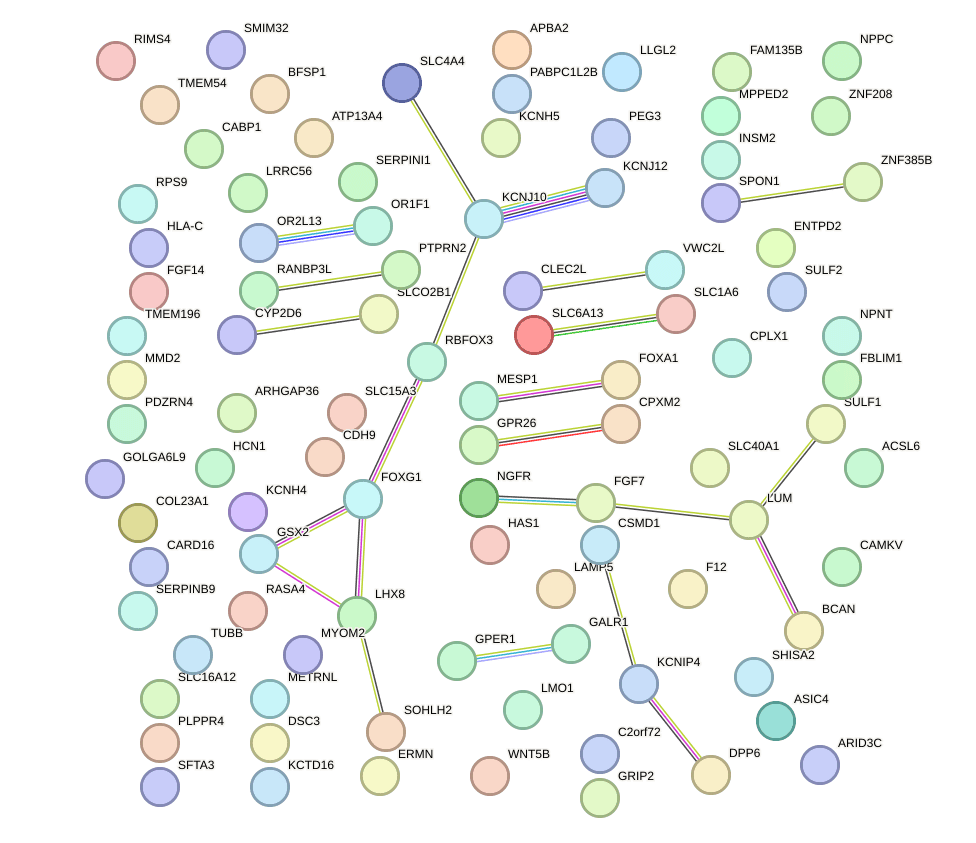

##### Clusterization
[Figure 15](figures/STRING/PD/string_clusterisation.png)

[Figure 15 - STRING website](https://version-12-0.string-db.org/cgi/network?networkId=b7FXBYqhMkk7)

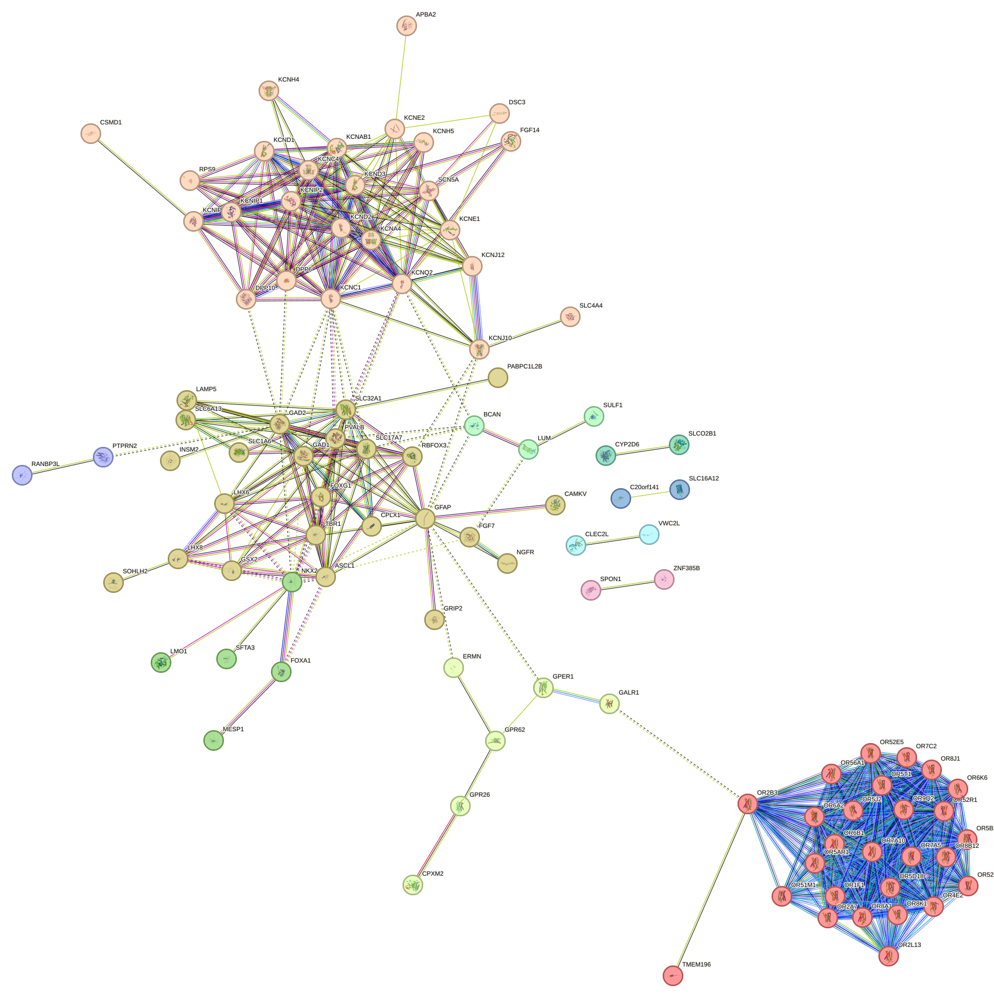

[Figure 16](figures/STRING/PD/clusterisation.png)

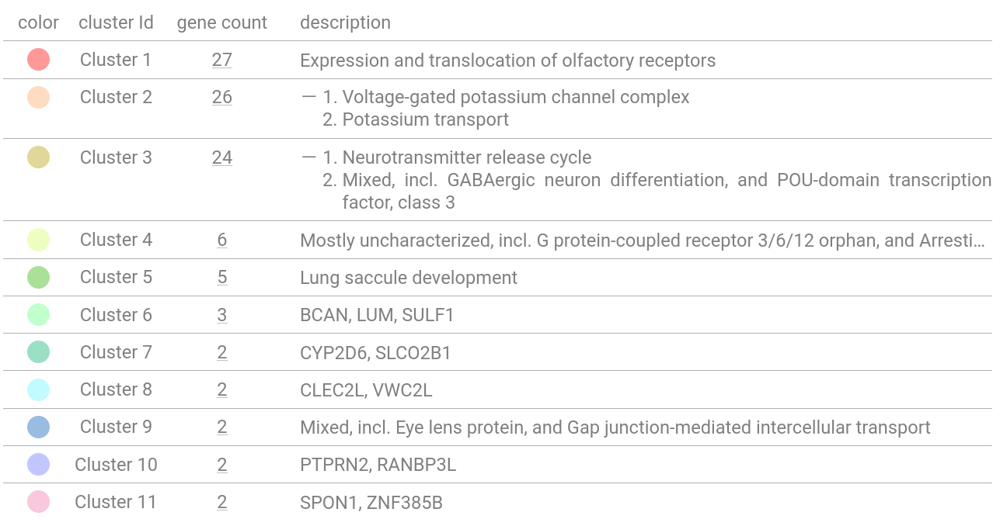

##### Olfactory cluster
[Figure 17](figures/STRING/PD/string_olfactory.png)

[Figure 17 - STRING website](https://version-12-0.string-db.org/cgi/network?networkId=bafQ1oqZUpwM)


[Figure 18](figures/STRING/PD/string_olfactory_enrichment_Function.svg)


```{r}
#| echo: false
olfactory_enrichment_Function <- read.csv("figures/STRING/PD/string_olfactory_enrichment_Function.tsv", sep = "\t")

colnames(olfactory_enrichment_Function) <- c("ID", "description", "observed.gene.count", "background.gene.count", "strength", "signal", "false.discovery.rate", "matching.proteins.IDs", "matching.proteins.labels")

datatable(olfactory_enrichment_Function, 
          caption = "Table 20. Gene Ontology Molecular Function enrichment for Olfactory cluster (STRING).",
          style = "bootstrap5", 
          extensions = 'Buttons', 
          options = list(dom = 'lBfrtip', 
              buttons = c('csv', 'excel')))
```

```{r}
#| message: false
#| warning: false
#| include: false
get_genes_from_list <- function(gene_list_df, 
                                ref_table = ensbl2geneid, 
                                col1 = "X.node1", 
                                col2 = "node2", 
                                gene_name_col = "gene_name") {
	
	unique_genes <- unique(c(gene_list_df[[col1]], gene_list_df[[col2]]))
	
	ref_table %>%
		filter(.data[[gene_name_col]] %in% unique_genes) %>%
		arrange(.data[[gene_name_col]]) %>%
		`rownames<-`(NULL)
}
```

```{r}
#| echo: false
olfactory_gene_list <- read.csv("figures/STRING/PD/string_olfactory_gene_list.tsv", sep = "\t")

olfactory_gene_list <- get_genes_from_list(olfactory_gene_list)

datatable(olfactory_gene_list, 
          caption = "Table 21. Genes in Olfactory cluster (STRING MCL).",
          style = "bootstrap5", 
          extensions = 'Buttons', 
          options = list(dom = 'lBfrtip', 
              buttons = c('csv', 'excel')))
```

##### VGPC cluster 1
[Figure 19](figures/STRING/PD/string_VGPC.png)

[Figure 19 - STRING website](https://version-12-0.string-db.org/cgi/network?networkId=bTNsDUkqkUeN)

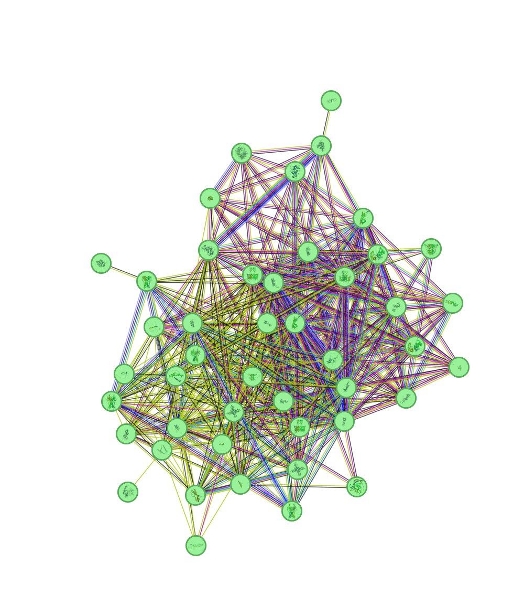

[Figure 20](figures/STRING/PD/string_VGPC_enrichment_RCTM.svg)


```{r}
#| echo: false
VGPC_enrichment_RCTM <- read.csv("figures/STRING/PD/string_VGPC_enrichment_RCTM.tsv", sep = "\t")
colnames(VGPC_enrichment_RCTM) <- c("ID", "description", "observed.gene.count", "background.gene.count", "strength", "signal", "false.discovery.rate", "matching.proteins.IDs", "matching.proteins.labels")

datatable(VGPC_enrichment_RCTM, 
          caption = "Table 22. Reactome pathway enrichment for VGPC cluster.",
          style = "bootstrap5", 
          extensions = 'Buttons', 
          options = list(dom = 'lBfrtip', 
              buttons = c('csv', 'excel')))
```

```{r}
#| echo: false
VGPC_gene_list <- read.csv("figures/STRING/PD/string_VGPC_gene_list.tsv", sep = "\t")

VGPC_gene_list <- get_genes_from_list(VGPC_gene_list)

datatable(VGPC_gene_list, 
          caption = "Table 23. Genes included in VGPC cluster.",
          style = "bootstrap5", 
          extensions = 'Buttons', 
          options = list(dom = 'lBfrtip', 
              buttons = c('csv', 'excel')))
```

##### Potassium ion transport
[Figure 21](figures/STRING/PD/string_cluster_3.png)

[Figure 21 - STRING website](https://version-12-0.string-db.org/cgi/network?networkId=bU76dbSYrbzZ)

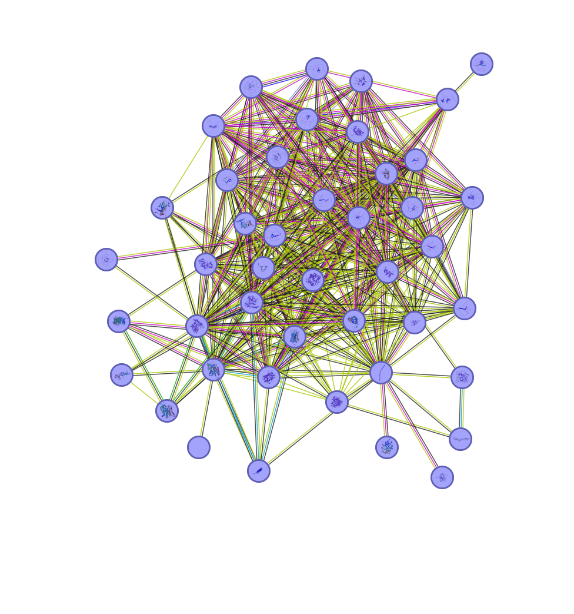

```{r}
#| echo: false
cluster_3_gene_list <- read.csv("figures/STRING/PD/string_cluster_3_gene_list.tsv", sep = "\t")

cluster_3_gene_list <- get_genes_from_list(cluster_3_gene_list)

datatable(cluster_3_gene_list, 
          caption = "Table 24. Genes in Potassium ion transport cluster.",
          style = "bootstrap5", 
          extensions = 'Buttons', 
          options = list(dom = 'lBfrtip', 
              buttons = c('csv', 'excel')))
```

[Table 25 - WebGestalt results](figures/STRING/PD/cluster_3_enrichment_results_wg.html)
```{r}
#| echo: false
cluster_3_enrichment_results_wg <- read.csv("figures/STRING/PD/cluster_3_enrichment_results_wg.txt", sep = "\t")

datatable(cluster_3_enrichment_results_wg, 
          caption = "Table 25. Over‑representation analysis of Potassium ion transport cluster.",
          style = "bootstrap5", 
          extensions = 'Buttons', 
          options = list(dom = 'lBfrtip', 
              buttons = c('csv', 'excel')))
```

## Consistent healthy‑associated genes
```{r}
#| include: false
consistent_Healthy <- c(unique_intersections$`Healthy_ALL & Healthy_LRKK2 & Healthy_Parkin`, unique_intersections$`Healthy_LRKK2 & Healthy_Parkin`)

consistent_Healthy.df <- ensbl2geneid[ensbl2geneid$gene_id %in% consistent_Healthy,]

rownames(consistent_Healthy.df) <- NULL
```

```{r}
#| echo: false
datatable(consistent_Healthy.df, 
          caption = "Table 26. Genes consistently downregulated across all PD comparisons (n = 270).",
          style = "bootstrap5", 
          extensions = 'Buttons', 
          options = list(dom = 'lBfrtip', 
              buttons = c('csv', 'excel')))
```

#### WebGestalt ORA
[Table 27 - WebGestalt results](figures/STRING/Healthy/healthy_enrichment_results_wg.html)

```{r}
#| echo: false
healthy_enrichment_results_wg <- read.csv("figures/STRING/Healthy/healthy_enrichment_results_wg.txt", sep = "\t")

datatable(healthy_enrichment_results_wg, 
          caption = "Table 27. Over‑representation analysis of Healthy‑associated genes.",
          style = "bootstrap5", 
          extensions = 'Buttons', 
          options = list(dom = 'lBfrtip', 
              buttons = c('csv', 'excel')))
```

#### STRING analysis
##### Raw network
[Figure 22](figures/STRING/Healthy/string_raw.png)

[Figure 22 - STRING website](https://version-12-0.string-db.org/cgi/network?networkId=bBi5bHf3h9kn)


##### Clusterization
[Figure 23](figures/STRING/Healthy/string_clustering.png)

[Figure 23 - STRING website](https://version-12-0.string-db.org/cgi/network?networkId=brN1OwlSrVBp)


[Figure 24](figures/STRING/Healthy/clustering.png)

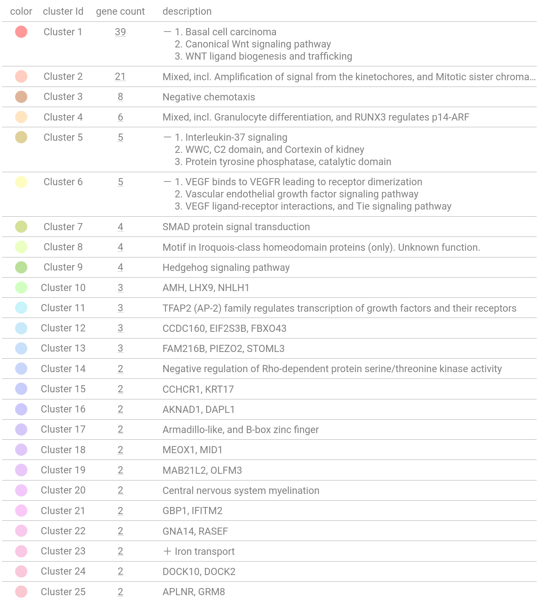

##### WNT cluster
[Figure 25](figures/STRING/Healthy/string_WNT.png)

[Figure 25 - STRING website](https://version-12-0.string-db.org/cgi/network?networkId=bGncWxCjBW27)

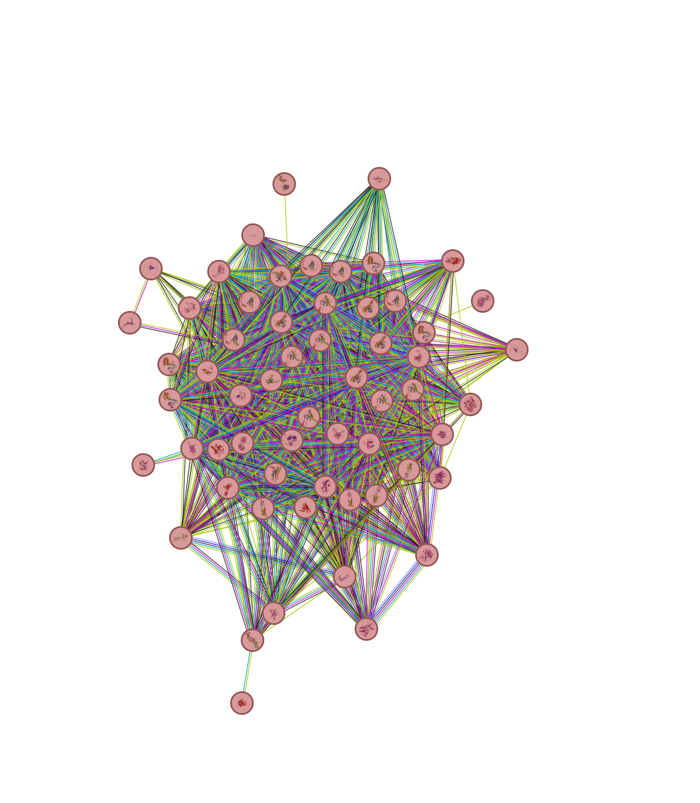

[Figure 26](figures/STRING/Healthy/string_WNT_enrichment_KEGG.svg)

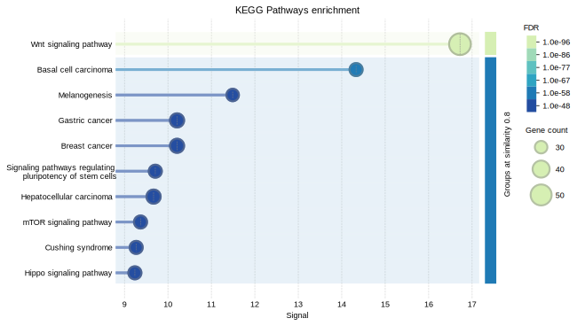

```{r}
#| echo: false
string_WNT_enrichment_KEGG <- read.csv("figures/STRING/Healthy/string_WNT_enrichment_KEGG.tsv", sep = "\t")

colnames(string_WNT_enrichment_KEGG) <- c("ID", "description", "observed.gene.count", "background.gene.count", "strength", "signal", "false.discovery.rate", "matching.proteins.IDs", "matching.proteins.labels")

datatable(string_WNT_enrichment_KEGG, 
          caption = "Table 28. KEGG pathway enrichment for WNT cluster.",
          style = "bootstrap5", 
          extensions = 'Buttons', 
          options = list(dom = 'lBfrtip', 
              buttons = c('csv', 'excel')))
```

```{r}
#| echo: false
string_WNT_gene_list <- read.csv("figures/STRING/Healthy/string_WNT_gene_list.tsv", sep = "\t")

string_WNT_gene_list <- get_genes_from_list(string_WNT_gene_list)

datatable(string_WNT_gene_list, 
          caption = "Table 29. Genes in WNT cluster.",
          style = "bootstrap5", 
          extensions = 'Buttons', 
          options = list(dom = 'lBfrtip', 
              buttons = c('csv', 'excel')))
```

##### Chromatin cluster
[Figure 27](figures/STRING/Healthy/string_chromatin.png)

[Figure 27 - STRING website](https://version-12-0.string-db.org/cgi/network?networkId=bYuhll6L6QbO)


[Figure 28](figures/STRING/Healthy/string_chromatin_enrichment_Process.svg)


```{r}
#| echo: false
string_chromatin_enrichment_Process <- read.csv("figures/STRING/Healthy/string_chromatin_enrichment_Process.tsv", sep = "\t")

colnames(string_chromatin_enrichment_Process) <- c("ID", "description", "observed.gene.count", "background.gene.count", "strength", "signal", "false.discovery.rate", "matching.proteins.IDs", "matching.proteins.labels")

datatable(string_chromatin_enrichment_Process, 
          caption = "Table 30. GO Biological Process enrichment for Chromatin cluster.",
          style = "bootstrap5", 
          extensions = 'Buttons', 
          options = list(dom = 'lBfrtip', 
              buttons = c('csv', 'excel')))
```

```{r}
#| echo: false
string_chromatin_gene_list <- read.csv("figures/STRING/Healthy/string_chromatin_gene_list.tsv", sep = "\t")

string_chromatin_gene_list <- get_genes_from_list(string_chromatin_gene_list)

datatable(string_chromatin_gene_list, 
          caption = "Table 31. Genes in Chromatin cluster.",
          style = "bootstrap5", 
          extensions = 'Buttons', 
          options = list(dom = 'lBfrtip', 
              buttons = c('csv', 'excel')))
```

[Table 32 - WebGestalt results](figures/STRING/Healthy/string_chromatin_enrichment_results_wg.html)

```{r}
#| echo: false
string_chromatin_enrichment_results_wg <- read.csv("figures/STRING/Healthy/string_chromatin_enrichment_results_wg.txt", sep = "\t")

datatable(string_chromatin_enrichment_results_wg, 
          caption = "Table 32. Over‑representation analysis of Chromatin cluster.",
          style = "bootstrap5", 
          extensions = 'Buttons', 
          options = list(dom = 'lBfrtip', 
              buttons = c('csv', 'excel')))
```

### Intersections between PD and Healthy linked DEG and STRING clusters
```{r}
#| include: false
DEG_STRING_1 <- list(PD = consistent_PD, 
                 Healthy = consistent_Healthy,
                 Olfactory = olfactory_gene_list$gene_id,
                 VGPC = VGPC_gene_list$gene_id,
                 Potassium_ion_transport = cluster_3_gene_list$gene_id,
                 WNT = string_WNT_gene_list$gene_id,
                 Chromatin = string_chromatin_gene_list$gene_id
)

DEG_STRING_upset_1 <- upset(fromList(DEG_STRING_1), 
      nintersects = 40, 
      nsets = 8, 
      order.by = "freq", 
      decreasing = T, 
      mb.ratio = c(0.6, 0.4),
      number.angles = 0, 
      text.scale = 1.1, 
      point.size = 2.8, 
      line.size = 1
)

# pdf("figures/DEG_STRING_upset_1.pdf", width = 8, height = 5)
# DEG_STRING_upset_1
# dev.off()
```

[Figure 29](figures/DEG_STRING_upset_1.pdf)

```{r fig.width=8, fig.height=5}
#| echo: false
#| message: false
#| warning: false
#| fig-cap: "Figure 29. UpSet plot showing overlaps between PD/Healthy DEGs and STRING clusters."
DEG_STRING_upset_1
```

### STRING clusters validation using GSEA
```{r}
#| include: false
get_ranks <- function(DEG){
      ranks.df <- -log10(DEG$pvalue)*sign(DEG$log2FoldChange)
      names(ranks.df) <- rownames(DEG)
      names(ranks.df) <- sapply(str_split(names(ranks.df), "\\."), function(x) x[1])    
      ranks.df <- sort(ranks.df, decreasing = T)
      return(ranks.df)
}

ranks <- get_ranks(deg)
ranks.lrrk2 <- get_ranks(degLRKK2)
ranks.Parkin <- get_ranks(degParkin)
ranks.B <- get_ranks(degB)
```

```{r}
#| include: false
gene_sets <- list(
	Olfactory = unique(olfactory_gene_list$gene_id),
	Potassium = c(unique(cluster_3_gene_list$gene_id), unique(VGPC_gene_list$gene_id)),
	WNT = unique(string_WNT_gene_list$gene_id),
	Chromatin = unique(string_chromatin_gene_list$gene_id)
)

custom_genesets <- bind_rows(
	lapply(names(gene_sets), function(gs) {
		data.frame(term = gs, gene = gene_sets[[gs]], stringsAsFactors = FALSE)
	})
)

ranks_list <- list(
	PD_vs_Healthy = ranks,
	LRRK2_vs_Healthy = ranks.lrrk2,
	Parkin_vs_Healthy = ranks.Parkin,
	LRRK2_vs_Parkin = ranks.B
)

gsea_results <- lapply(ranks_list, function(r) {
	GSEA(geneList = r, TERM2GENE = custom_genesets[, c("term", "gene")],
	     eps = 0, pAdjustMethod = "fdr", pvalueCutoff = 0.05, seed = 13)
})

gsea_dfs <- lapply(gsea_results, function(res) {
	df <- as.data.frame(res)
	rownames(df) <- NULL
	df
})

common_gsea_list <- gsea_results[c("PD_vs_Healthy", "LRRK2_vs_Healthy", "Parkin_vs_Healthy")]

common_gsea_1 <- GSEAmultiGP(
	gsea_list = common_gsea_list,
	geneSetID = "Potassium",
	exp_name = c("PD vs Healthy", "LRRK2 vs Healthy", "Parkin vs Healthy"),
	legend.position = "right",
	curve.col = brewer.pal(n = 4, name = "Set1")
)

common_gsea_2 <- GSEAmultiGP(
	gsea_list = common_gsea_list,
	geneSetID = "Chromatin",
	exp_name = c("PD vs Healthy", "LRRK2 vs Healthy", "Parkin vs Healthy"),
	legend.position = "right",
	curve.col = brewer.pal(n = 4, name = "Set1")
)

common_gsea_3 <- GSEAmultiGP(
	gsea_list = common_gsea_list,
	geneSetID = "WNT",
	exp_name = c("PD vs Healthy", "LRRK2 vs Healthy", "Parkin vs Healthy"),
	legend.position = "right",
	curve.col = brewer.pal(n = 4, name = "Set1")
)

```

```{r}
#| echo: false
#| message: false
#| warning: false
gseaDEG.df_1 <- as.data.frame(gsea_results$PD_vs_Healthy)[c(2:9)]

datatable(gseaDEG.df_1, 
          caption = "Table 33. GSEA results for custom gene sets in PD vs Healthy comparison.",
          style = "bootstrap5", 
          extensions = 'Buttons', 
          options = list(dom = 'lBfrtip', 
              buttons = c('csv', 'excel')))
```

```{r}
#| echo: false
#| message: false
#| warning: false
gseaDEG.df_2 <- as.data.frame(gsea_results$LRRK2_vs_Healthy)[c(2:9)]

datatable(gseaDEG.df_2, 
          caption = "Table 34. GSEA results for custom gene sets in LRRK2 vs Healthy comparison.",
          style = "bootstrap5", 
          extensions = 'Buttons', 
          options = list(dom = 'lBfrtip', 
              buttons = c('csv', 'excel')))
```

```{r}
#| echo: false
#| message: false
#| warning: false
gseaDEG.df_3 <- as.data.frame(gsea_results$Parkin_vs_Healthy)[c(2:9)]

datatable(gseaDEG.df_3, 
          caption = "Table 35. GSEA results for custom gene sets in Parkin vs Healthy comparison.",
          style = "bootstrap5", 
          extensions = 'Buttons', 
          options = list(dom = 'lBfrtip', 
              buttons = c('csv', 'excel')))
```

```{r}
#| echo: false
#| message: false
#| warning: false
gseaDEG.df_4 <- as.data.frame(gsea_results$LRRK2_vs_Parkin)[c(2:9)]

datatable(gseaDEG.df_4, 
          caption = "Table 36. GSEA results for custom gene sets in LRRK2 vs Parkin comparison.",
          style = "bootstrap5", 
          extensions = 'Buttons', 
          options = list(dom = 'lBfrtip', 
              buttons = c('csv', 'excel')))
```

```{r fig.width=6.5, fig.height=4.5}
#| echo: false
#| message: false
#| warning: false
download_this(
      common_gsea_1,
      output_name = "common_gsea_1",
      output_extension = ".svg",
      button_label = "SVG",
      button_type = "primary"
)
```

```{r fig.width=6.5, fig.height=4.5}
#| echo: false
#| message: false
#| warning: false
#| fig-cap: "Figure 30. GSEA enrichment plots for the Potassium gene set in three comparisons."
common_gsea_1
```

```{r fig.width=6.5, fig.height=4.5}
#| echo: false
#| message: false
#| warning: false
download_this(
      common_gsea_2,
      output_name = "common_gsea_2",
      output_extension = ".svg",
      button_label = "SVG",
      button_type = "primary"
)
```

```{r fig.width=6.5, fig.height=4.5}
#| echo: false
#| message: false
#| warning: false
#| fig-cap: "Figure 31. GSEA enrichment plots for the Chromatin gene set."
common_gsea_2
```

```{r fig.width=6.5, fig.height=4.5}
#| echo: false
#| message: false
#| warning: false
download_this(
      common_gsea_3,
      output_name = "common_gsea_3",
      output_extension = ".svg",
      button_label = "SVG",
      button_type = "primary"
)
```

```{r fig.width=6.5, fig.height=4.5}
#| echo: false
#| message: false
#| warning: false
#| fig-cap: "Figure 32. GSEA enrichment plots for the WNT gene set."
common_gsea_3
```

## LRRK2‑specific gene signatures
### Upregulated genes in LRRK2
```{r}
#| include: false
LRRK2_up = unique_intersections$`PD_LRKK2 & LRRK2`
LRRK2_up.df <- ensbl2geneid[ensbl2geneid$gene_id %in% LRRK2_up,]
rownames(LRRK2_up.df) <- NULL
```

```{r}
#| echo: false
datatable(LRRK2_up.df, 
          caption = "Table 37. Genes consistently upregulated in LRRK2 group across comparisons (n = 503).",
          style = "bootstrap5", 
          extensions = 'Buttons', 
          options = list(dom = 'lBfrtip', 
              buttons = c('csv', 'excel')))
```

#### WebGestalt ORA
[Table 38 - WebGestalt results](figures/STRING/LRRK2_up/LRRK2_up_enrichment_results_wg.html)

```{r}
#| echo: false
LRRK2_up_enrichment_results_wg <- read.csv("figures/STRING/LRRK2_up/LRRK2_up_enrichment_results_wg.txt", sep = "\t")

datatable(LRRK2_up_enrichment_results_wg, 
          caption = "Table 38. Over‑representation analysis of LRRK2‑upregulated genes.",
          style = "bootstrap5", 
          extensions = 'Buttons', 
          options = list(dom = 'lBfrtip', 
              buttons = c('csv', 'excel')))
```

#### STRING analysis
##### Raw network
[Figure 33](figures/STRING/LRRK2_up/string_raw.png)

[Figure 33 - STRING website](https://version-12-0.string-db.org/cgi/network?networkId=bDypb2taIwBM)


##### Clusterization
[Figure 34](figures/STRING/LRRK2_up/string_clusterisation.png)

[Figure 34 - STRING website](https://version-12-0.string-db.org/cgi/network?networkId=bk9OiBJJknj8)

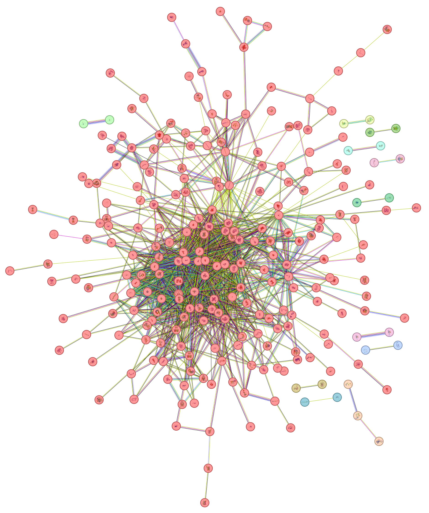

[Figure 35](figures/STRING/LRRK2_up/clusterisation.png)

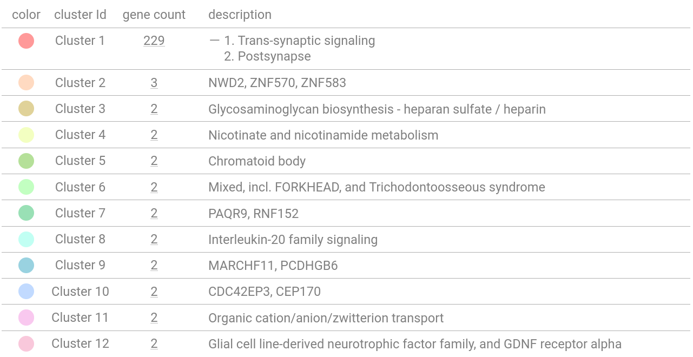

##### Synapse cluster
[Figure 36](figures/STRING/LRRK2_up/string_synapse.png)

[Figure 36 - STRING website](https://version-12-0.string-db.org/cgi/network?networkId=b24LWMywmW9R)

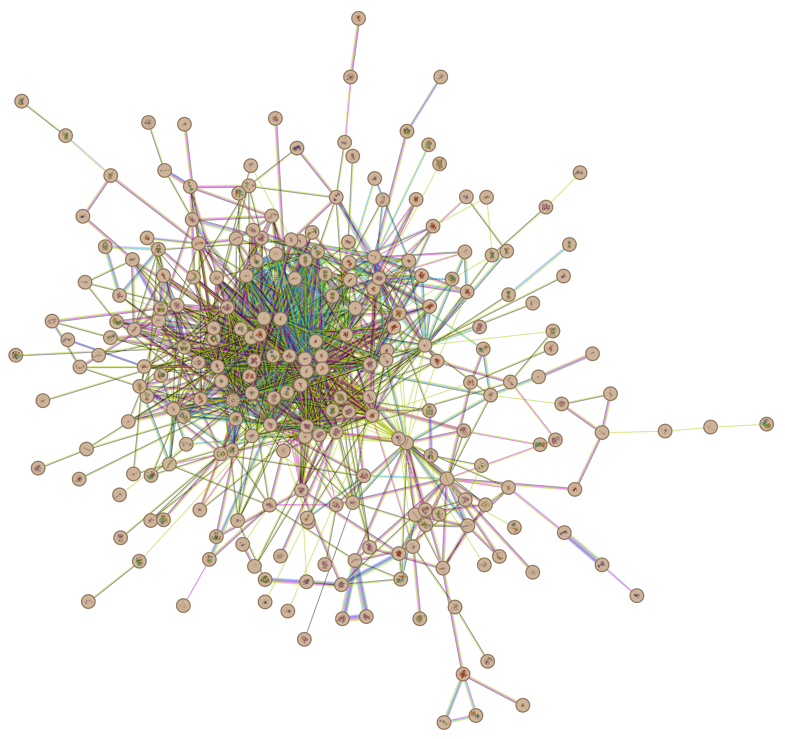

```{r}
#| echo: false
synapse_gene_list <- read.csv("figures/STRING/LRRK2_up/string_synapse_gene_list.tsv", sep = "\t")

synapse_gene_list <- get_genes_from_list(synapse_gene_list)

datatable(synapse_gene_list, 
          caption = "Table 39. Genes in Synapse cluster (STRING MCL).",
          style = "bootstrap5", 
          extensions = 'Buttons', 
          options = list(dom = 'lBfrtip', 
              buttons = c('csv', 'excel')))
```

[Table 40 - WebGestalt results](figures/STRING/LRRK2_up/string_synapse_enrichment_results_wg.html)

```{r}
#| echo: false
synapse_enrichment_results_wg <- read.csv("figures/STRING/LRRK2_up/string_synapse_enrichment_results_wg.txt", sep = "\t")

datatable(synapse_enrichment_results_wg, 
          caption = "Table 40. Over‑representation analysis of Synapse cluster.",
          style = "bootstrap5", 
          extensions = 'Buttons', 
          options = list(dom = 'lBfrtip', 
              buttons = c('csv', 'excel')))
```

### Downregulated genes in LRRK2
```{r}
#| include: false
LRRK2_down = unique_intersections$`Healthy_LRKK2 & Parkin`
LRRK2_down.df <- ensbl2geneid[ensbl2geneid$gene_id %in% LRRK2_down,]
rownames(LRRK2_down.df) <- NULL
```

```{r}
#| echo: false
datatable(LRRK2_down.df, 
          caption = "Table 41. Genes consistently downregulated in LRRK2 group across comparisons (n = 1141).",
          style = "bootstrap5", 
          extensions = 'Buttons', 
          options = list(dom = 'lBfrtip', 
              buttons = c('csv', 'excel')))
```

#### WebGestalt ORA
[Table 42 - WebGestalt results](figures/STRING/LRRK2_down/LRRK2_down_enrichment_results_wg.html)

```{r}
#| echo: false
LRRK2_down_enrichment_results_wg <- read.csv("figures/STRING/LRRK2_down/LRRK2_down_enrichment_results_wg.txt", sep = "\t")

datatable(LRRK2_down_enrichment_results_wg, 
          caption = "Table 42. Over‑representation analysis of LRRK2‑downregulated genes.",
          style = "bootstrap5", 
          extensions = 'Buttons', 
          options = list(dom = 'lBfrtip', 
              buttons = c('csv', 'excel')))
```

#### STRING analysis
##### Raw network
[Figure 37](figures/STRING/LRRK2_down/string_raw.svg)

[Figure 37 - STRING website](https://version-12-0.string-db.org/cgi/network?networkId=bc2iui0fiKvS)


##### Clusterization
[Figure 38](figures/STRING/LRRK2_down/string_clusterisation.png)

[Figure 38 - STRING website](https://version-12-0.string-db.org/cgi/network?networkId=bs06sesb86bX)

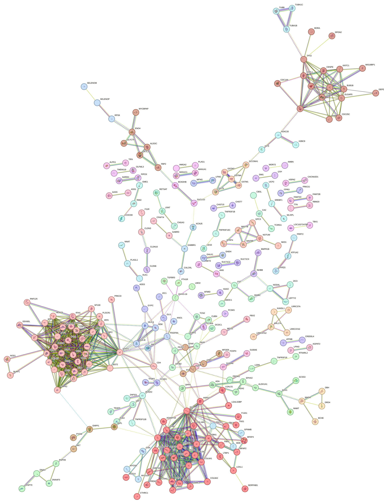

[Figure 39](figures/STRING/LRRK2_down/clusterisation.png)


##### ECM cluster
[Figure 40](figures/STRING/LRRK2_down/string_ECM.png)

[Figure 40 - STRING website](https://version-12-0.string-db.org/cgi/network?networkId=bXGSCw6dlMai)


[Figure 41](figures/STRING/LRRK2_down/string_ECM_enrichment_RCTM.svg)


```{r}
#| echo: false
ECM_enrichment_RCTM <- read.csv("figures/STRING/LRRK2_down/string_ECM_enrichment_RCTM.tsv", sep = "\t")

colnames(ECM_enrichment_RCTM) <- c("ID", "description", "observed.gene.count", "background.gene.count", "strength", "signal", "false.discovery.rate", "matching.proteins.IDs", "matching.proteins.labels")

datatable(ECM_enrichment_RCTM, 
          caption = "Table 43. Reactome pathway enrichment for ECM cluster.",
          style = "bootstrap5", 
          extensions = 'Buttons', 
          options = list(dom = 'lBfrtip', 
              buttons = c('csv', 'excel')))
```

```{r}
#| echo: false
ECM_gene_list <- read.csv("figures/STRING/LRRK2_down/string_ECM_gene_list.tsv", sep = "\t")

ECM_gene_list <- get_genes_from_list(ECM_gene_list)

datatable(ECM_gene_list, 
          caption = "Table 44. Genes in ECM cluster.",
          style = "bootstrap5", 
          extensions = 'Buttons', 
          options = list(dom = 'lBfrtip', 
              buttons = c('csv', 'excel')))
```

##### Interferon cluster
[Figure 42](figures/STRING/LRRK2_down/string_interferon.png)

[Figure 42 - STRING website](https://version-12-0.string-db.org/cgi/network?networkId=bXJ6psXkrY62)

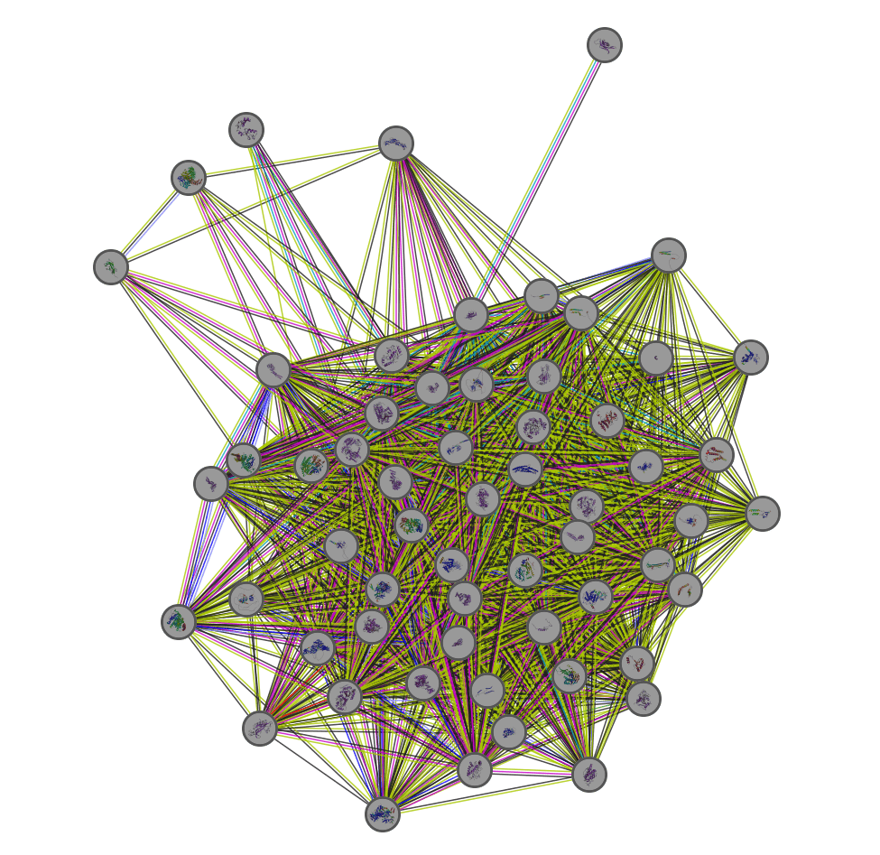

[Figure 43](figures/STRING/LRRK2_down/string_interferon_enrichment_RCTM.svg)


```{r}
#| echo: false
interferon_enrichment_RCTM <- read.csv("figures/STRING/LRRK2_down/string_interferon_enrichment_RCTM.tsv", sep = "\t")

colnames(interferon_enrichment_RCTM) <- c("ID", "description", "observed.gene.count", "background.gene.count", "strength", "signal", "false.discovery.rate", "matching.proteins.IDs", "matching.proteins.labels")

datatable(interferon_enrichment_RCTM, 
          caption = "Table 45. Reactome pathway enrichment for Interferon cluster.",
          style = "bootstrap5", 
          extensions = 'Buttons', 
          options = list(dom = 'lBfrtip', 
              buttons = c('csv', 'excel')))
```

```{r}
#| echo: false
interferon_gene_list <- read.csv("figures/STRING/LRRK2_down/string_interferon_gene_list.tsv", sep = "\t")

interferon_gene_list <- get_genes_from_list(interferon_gene_list)

datatable(interferon_gene_list, 
          caption = "Table 46. Genes in Interferon cluster.",
          style = "bootstrap5", 
          extensions = 'Buttons', 
          options = list(dom = 'lBfrtip', 
              buttons = c('csv', 'excel')))
```

### Insertions between PD and Healthy linked DEG and STRING clusters
```{r}
#| include: false
DEG_STRING_2 <- list(LRRK2_up = LRRK2_up, 
                     LRRK2_down = LRRK2_down,
                     Synapse = synapse_gene_list$gene_id,
                     ECM = ECM_gene_list$gene_id,
                     Interferon = interferon_gene_list$gene_id
)

DEG_STRING_upset_2 <- upset(fromList(DEG_STRING_2), 
      nintersects = 40, 
      nsets = 8, 
      order.by = "freq", 
      decreasing = T, 
      mb.ratio = c(0.6, 0.4),
      number.angles = 0, 
      text.scale = 1.1, 
      point.size = 2.8, 
      line.size = 1
)

# pdf("figures/DEG_STRING_upset_2.pdf", width = 8, height = 5)
# DEG_STRING_upset_2
# dev.off()
```

[Figure 44](figures/DEG_STRING_upset_2.pdf)

```{r fig.width=8, fig.height=5}
#| echo: false
#| message: false
#| warning: false
#| fig-cap: "Figure 44. UpSet plot of overlaps between LRRK2 DEGs and STRING clusters."
DEG_STRING_upset_2
```

### STRING clusters validation using GSEA
```{r}
#| include: false
gene_sets_lrrk2 <- list(
	Synapse = unique(synapse_gene_list$gene_id),
	ECM = unique(ECM_gene_list$gene_id),
	Interferon = unique(interferon_gene_list$gene_id)
)

custom_genesets.lrrk2 <- bind_rows(
	lapply(names(gene_sets_lrrk2), function(gs) {
		data.frame(term = gs, gene = gene_sets_lrrk2[[gs]], stringsAsFactors = FALSE)
	})
)

ranks_list <- list(
	PD_vs_Healthy = ranks,
	LRRK2_vs_Healthy = ranks.lrrk2,
	Parkin_vs_Healthy = ranks.Parkin,
	LRRK2_vs_Parkin = ranks.B
)

gsea_results_lrrk2 <- lapply(ranks_list, function(r) {
	GSEA(geneList = r, TERM2GENE = custom_genesets.lrrk2[, c("term", "gene")],
	     eps = 0, pAdjustMethod = "fdr", pvalueCutoff = 0.05, seed = 13)
})

gseaDEG.lrrk2_1 <- gsea_results_lrrk2[["PD_vs_Healthy"]]
gseaDEG.lrrk2_2 <- gsea_results_lrrk2[["LRRK2_vs_Healthy"]]
gseaDEG.lrrk2_3 <- gsea_results_lrrk2[["Parkin_vs_Healthy"]]
gseaDEG.lrrk2_4 <- gsea_results_lrrk2[["LRRK2_vs_Parkin"]]

gseaDEG.lrrk2.df_1 <- as.data.frame(gseaDEG.lrrk2_1)
rownames(gseaDEG.lrrk2.df_1) <- NULL

gseaDEG.lrrk2.df_2 <- as.data.frame(gseaDEG.lrrk2_2)
rownames(gseaDEG.lrrk2.df_2) <- NULL

gseaDEG.lrrk2.df_3 <- as.data.frame(gseaDEG.lrrk2_3)
rownames(gseaDEG.lrrk2.df_3) <- NULL

gseaDEG.lrrk2.df_4 <- as.data.frame(gseaDEG.lrrk2_4)
rownames(gseaDEG.lrrk2.df_4) <- NULL

common_gsea_list_lrrk2 <- list(gseaDEG.lrrk2_2, gseaDEG.lrrk2_4)

exp_names_lrrk2 <- c("LRRK2 vs Healthy", "LRRK2 vs Parkin")
curve_colors <- brewer.pal(n = 4, name = "Set1")[c(2, 4)]

lrrk2_gsea_1 <- GSEAmultiGP(
	gsea_list = common_gsea_list_lrrk2,
	geneSetID = "Synapse",
	exp_name = exp_names_lrrk2,
	legend.position = "right",
	curve.col = curve_colors
)

lrrk2_gsea_2 <- GSEAmultiGP(
	gsea_list = common_gsea_list_lrrk2,
	geneSetID = "Interferon",
	exp_name = exp_names_lrrk2,
	legend.position = "right",
	curve.col = curve_colors
)

lrrk2_gsea_3 <- GSEAmultiGP(
	gsea_list = common_gsea_list_lrrk2,
	geneSetID = "ECM",
	exp_name = exp_names_lrrk2,
	legend.position = "right",
	curve.col = curve_colors
)
```

```{r}
#| echo: false
#| message: false
#| warning: false
datatable(gseaDEG.lrrk2.df_1[c(2:9)], 
          caption = "Table 47. GSEA results for LRRK2‑derived gene sets in PD vs Healthy comparison.",
          style = "bootstrap5", 
          extensions = 'Buttons', 
          options = list(dom = 'lBfrtip', 
              buttons = c('csv', 'excel')))
```

```{r}
#| echo: false
#| message: false
#| warning: false
datatable(gseaDEG.lrrk2.df_2[c(2:9)], 
          caption = "Table 48. GSEA results for LRRK2‑derived gene sets in LRRK2 vs Healthy comparison.",
          style = "bootstrap5", 
          extensions = 'Buttons', 
          options = list(dom = 'lBfrtip', 
              buttons = c('csv', 'excel')))
```

```{r}
#| echo: false
#| message: false
#| warning: false
datatable(gseaDEG.lrrk2.df_4[c(2:9)], 
          caption = "Table 49. GSEA results for LRRK2‑derived gene sets in LRRK2 vs Parkin comparison.",
          style = "bootstrap5", 
          extensions = 'Buttons', 
          options = list(dom = 'lBfrtip', 
              buttons = c('csv', 'excel')))
```

```{r fig.width=6.5, fig.height=4.5}
#| echo: false
#| message: false
#| warning: false
download_this(
      lrrk2_gsea_1,
      output_name = "lrrk2_gsea_1",
      output_extension = ".svg",
      button_label = "SVG",
      button_type = "primary"
)
```

```{r fig.width=6.5, fig.height=4.5}
#| echo: false
#| message: false
#| warning: false
#| fig-cap: "Figure 45. GSEA enrichment plots for the Synapse gene set."
lrrk2_gsea_1
```

```{r fig.width=6.5, fig.height=4.5}
#| echo: false
#| message: false
#| warning: false
download_this(
      lrrk2_gsea_2,
      output_name = "lrrk2_gsea_2",
      output_extension = ".svg",
      button_label = "SVG",
      button_type = "primary"
)
```

```{r fig.width=6.5, fig.height=4.5}
#| echo: false
#| message: false
#| warning: false
#| fig-cap: "Figure 46. GSEA enrichment plots for the Interferon gene set."
lrrk2_gsea_2
```

```{r fig.width=6.5, fig.height=4.5}
#| echo: false
#| message: false
#| warning: false
download_this(
      lrrk2_gsea_3,
      output_name = "lrrk2_gsea_3",
      output_extension = ".svg",
      button_label = "SVG",
      button_type = "primary"
)
```

```{r fig.width=6.5, fig.height=4.5}
#| echo: false
#| message: false
#| warning: false
#| fig-cap: "Figure 47. GSEA enrichment plots for the ECM gene set."
lrrk2_gsea_3
```

## Parkin‑specific gene signatures
### Upregulated genes in Parkin
```{r}
#| include: false
Parkin_up <- unique_intersections$`PD_Parkin & Parkin`
Parkin_up.df <- ensbl2geneid[ensbl2geneid$gene_id %in% Parkin_up,]
rownames(Parkin_up.df) <- NULL
```

```{r}
#| echo: false
datatable(Parkin_up.df, 
          caption = "Table 50. Genes consistently upregulated in Parkin group across comparisons (n = 124).",
          style = "bootstrap5", 
          extensions = 'Buttons', 
          options = list(dom = 'lBfrtip', 
              buttons = c('csv', 'excel')))
```

#### WebGestalt ORA
[Table 51 - WebGestalt results](figures/STRING/Parkin_up/Parkin_up_enrichment_results_wg.html)

```{r}
#| echo: false
Parkin_up_enrichment_results_wg <- read.csv("figures/STRING/Parkin_up/Parkin_up_enrichment_results_wg.txt", sep = "\t")

datatable(Parkin_up_enrichment_results_wg, 
          caption = "Table 51. Over‑representation analysis of Parkin‑upregulated genes.",
          style = "bootstrap5", 
          extensions = 'Buttons', 
          options = list(dom = 'lBfrtip', 
              buttons = c('csv', 'excel')))
```

#### STRING analysis
##### Raw network
[Figure 48](figures/STRING/Parkin_up/string_raw.png)

[Figure 48 - STRING website](https://version-12-0.string-db.org/cgi/network?networkId=bZabxpJUZ5JK)

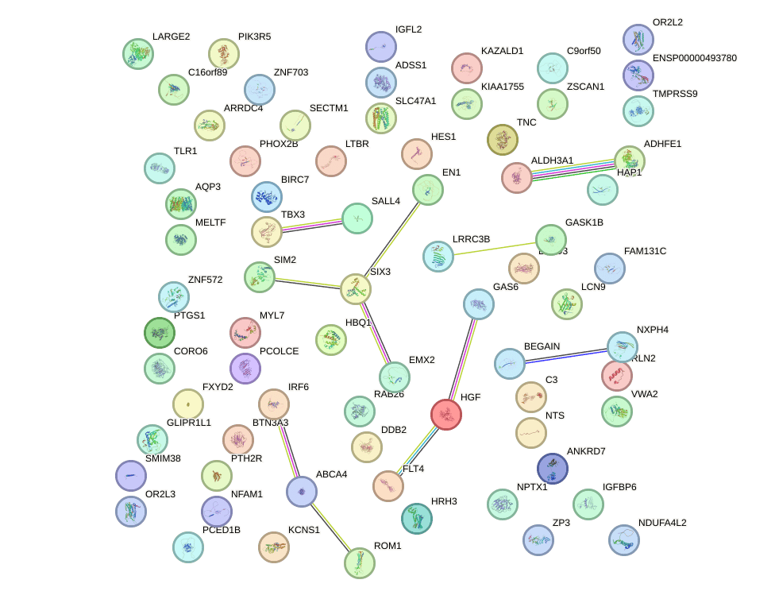

##### Clusterization
[Figure 49](figures/STRING/Parkin_up/string_clusterisation.png)

[Figure 49 - STRING website](https://version-12-0.string-db.org/cgi/network?networkId=bFthhtmsAAB0)


[Figure 50](figures/STRING/Parkin_up/clusterisation.png)


##### Retina cluster
[Figure 51](figures/STRING/Parkin_up/string_retina.png)

[Figure 51 - STRING website](https://version-12-0.string-db.org/cgi/network?networkId=broF4y138llJ)

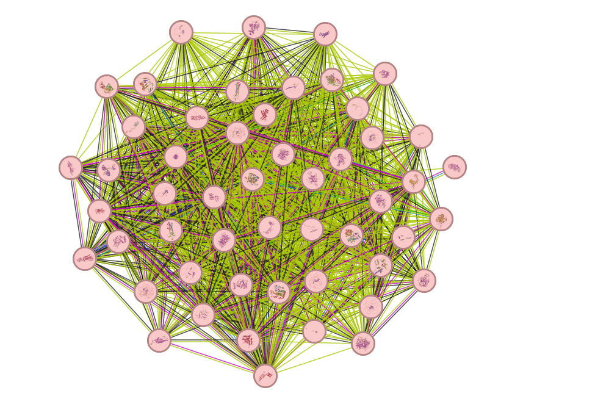

[Figure 52](figures/STRING/Parkin_up/string_retina_enrichment_Process.svg)


```{r}
#| echo: false
retina_enrichment_Process <- read.csv("figures/STRING/Parkin_up/string_retina_enrichment_Process.tsv", sep = "\t")

colnames(retina_enrichment_Process) <- c("ID", "description", "observed.gene.count", "background.gene.count", "strength", "signal", "false.discovery.rate", "matching.proteins.IDs", "matching.proteins.labels")

datatable(retina_enrichment_Process, 
          caption = "Table 52. GO Biological Process enrichment for Retina cluster.",
          style = "bootstrap5", 
          extensions = 'Buttons', 
          options = list(dom = 'lBfrtip', 
              buttons = c('csv', 'excel')))
```

```{r}
#| echo: false
retina_gene_list <- read.csv("figures/STRING/Parkin_up/string_retina_gene_list.tsv", sep = "\t")

retina_gene_list <- get_genes_from_list(retina_gene_list)

datatable(retina_gene_list, 
          caption = "Table 53. Genes in Retina cluster.",
          style = "bootstrap5", 
          extensions = 'Buttons', 
          options = list(dom = 'lBfrtip', 
              buttons = c('csv', 'excel')))
```

### Downregulated genes in Parkin
```{r}
#| include: false
Parkin_down = unique_intersections$`Healthy_Parkin & LRRK2`
Parkin_down.df <- ensbl2geneid[ensbl2geneid$gene_id %in% Parkin_down,]
rownames(Parkin_down.df) <- NULL
```

```{r}
#| echo: false
datatable(Parkin_down.df, 
          caption = "Table 54. Genes consistently downregulated in Parkin group across comparisons (n = 96).",
          style = "bootstrap5", 
          extensions = 'Buttons', 
          options = list(dom = 'lBfrtip', 
              buttons = c('csv', 'excel')))
```

#### WebGestalt ORA
[Table 55 - WebGestalt results](figures/STRING/Parkin_down/Parkin_down_enrichment_results_wg.html)

```{r}
#| echo: false
Parkin_down_enrichment_results_wg <- read.csv("figures/STRING/Parkin_down/Parkin_down_enrichment_results_wg.txt", sep = "\t")

datatable(Parkin_down_enrichment_results_wg, 
          caption = "Table 55. Over‑representation analysis of Parkin‑downregulated genes.",
          style = "bootstrap5", 
          extensions = 'Buttons', 
          options = list(dom = 'lBfrtip', 
              buttons = c('csv', 'excel')))
```

#### STRING analysis
##### Raw network
[Figure 53](figures/STRING/Parkin_down/string_raw.png)

[Figure 53 - STRING website](https://version-12-0.string-db.org/cgi/network?networkId=b5gnoSwsCVPe)


##### Clusterization
[Figure 54](figures/STRING/Parkin_down/string_clusterisation.png)

[Figure 54 - STRING website](https://version-12-0.string-db.org/cgi/network?networkId=bjsA7cFzCU8e)


[Figure 55](figures/STRING/Parkin_down/clusterisation.png)

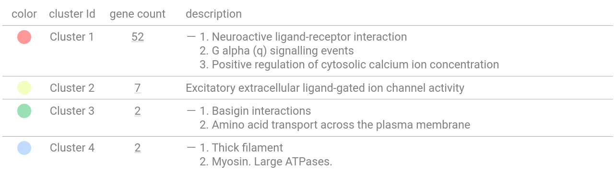

##### GPCR cluster
[Figure 56](figures/STRING/Parkin_down/string_GPCR.png)

[Figure 56 - STRING website](https://version-12-0.string-db.org/cgi/network?networkId=bodcxix6qARf)


[Figure 57](figures/STRING/Parkin_down/string_GPCR_enrichment_RCTM.svg)

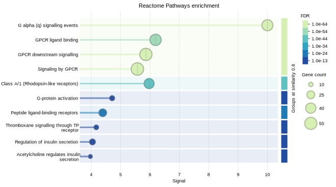

```{r}
#| echo: false
GPCR_enrichment_RCTM <- read.csv("figures/STRING/Parkin_down/string_GPCR_enrichment_RCTM.tsv", sep = "\t")

colnames(GPCR_enrichment_RCTM) <- c("ID", "description", "observed.gene.count", "background.gene.count", "strength", "signal", "false.discovery.rate", "matching.proteins.IDs", "matching.proteins.labels")

datatable(GPCR_enrichment_RCTM, 
          caption = "Table 56. Reactome pathway enrichment for GPCR cluster.",
          style = "bootstrap5", 
          extensions = 'Buttons', 
          options = list(dom = 'lBfrtip', 
              buttons = c('csv', 'excel')))
```

```{r}
#| echo: false
GPCR_gene_list <- read.csv("figures/STRING/Parkin_down/string_GPCR_gene_list.tsv", sep = "\t")

GPCR_gene_list <- get_genes_from_list(GPCR_gene_list)

datatable(GPCR_gene_list, 
          caption = "Table 57. Genes in GPCR cluster.",
          style = "bootstrap5", 
          extensions = 'Buttons', 
          options = list(dom = 'lBfrtip', 
              buttons = c('csv', 'excel')))
```

### Insertions between PD and Healthy linked DEG and STRING clusters
```{r}
#| include: false
DEG_STRING_3 <- list(Parkin_up = Parkin_up, 
                     Parkin_down = Parkin_down,
                     Retina = retina_gene_list$gene_id,
                     GPCR = GPCR_gene_list$gene_id
)

DEG_STRING_upset_3 <- upset(fromList(DEG_STRING_3), 
      nintersects = 40, 
      nsets = 8, 
      order.by = "freq", 
      decreasing = T, 
      mb.ratio = c(0.6, 0.4),
      number.angles = 0, 
      text.scale = 1.1, 
      point.size = 2.8, 
      line.size = 1
)

# pdf("figures/DEG_STRING_upset_3.pdf", width = 8, height = 5)
# DEG_STRING_upset_3
# dev.off()
```

[Figure 58](figures/DEG_STRING_upset_3.pdf)

```{r fig.width=8, fig.height=5}
#| echo: false
#| message: false
#| warning: false
#| fig-cap: "Figure 58. UpSet plot of overlaps between Parkin DEGs and STRING clusters."
DEG_STRING_upset_3
```

### STRING clusters validation using GSEA
```{r}
#| include: false
gene_sets_Parkin <- list(
	Retina = unique(retina_gene_list$gene_id),
	GPCR = unique(GPCR_gene_list$gene_id)
)

custom_genesets.Parkin <- bind_rows(
	lapply(names(gene_sets_Parkin), function(gs) {
		data.frame(term = gs, gene = gene_sets_Parkin[[gs]], stringsAsFactors = FALSE)
	})
)

ranks_list <- list(
	PD_vs_Healthy = ranks,
	LRRK2_vs_Healthy = ranks.lrrk2,
	Parkin_vs_Healthy = ranks.Parkin,
	LRRK2_vs_Parkin = ranks.B
)

gsea_results_Parkin <- lapply(ranks_list, function(r) {
	GSEA(geneList = r, TERM2GENE = custom_genesets.Parkin[, c("term", "gene")],
	     eps = 0, pAdjustMethod = "fdr", pvalueCutoff = 0.05, seed = 13)
})

gseaDEG.Parkin_1 <- gsea_results_Parkin[["Parkin_vs_Healthy"]]
gseaDEG.Parkin_2 <- gsea_results_Parkin[["LRRK2_vs_Healthy"]]
gseaDEG.Parkin_3 <- gsea_results_Parkin[["PD_vs_Healthy"]]
gseaDEG.Parkin_4 <- gsea_results_Parkin[["LRRK2_vs_Parkin"]]

gseaDEG.Parkin.df_1 <- as.data.frame(gseaDEG.Parkin_1)
rownames(gseaDEG.Parkin.df_1) <- NULL

gseaDEG.Parkin.df_4 <- as.data.frame(gseaDEG.Parkin_4)
rownames(gseaDEG.Parkin.df_4) <- NULL

gsea.parkin_list <- list(gseaDEG.Parkin_1, gseaDEG.Parkin_4)

gsea_3 <- GSEAmultiGP(
	gsea_list = gsea.parkin_list,
	geneSetID = "GPCR",
	exp_name = c("Parkin vs Healthy", "LRRK2 vs Parkin"),
	legend.position = "right",
	curve.col = brewer.pal(n = 4, name = "Set1")[c(3, 4)]
)
```

```{r}
#| echo: false
#| message: false
#| warning: false
datatable(gseaDEG.Parkin.df_1[c(2:9)], 
          caption = "Table 58. GSEA results for Parkin‑derived gene sets in Parkin vs Healthy comparison.",
          style = "bootstrap5", 
          extensions = 'Buttons', 
          options = list(dom = 'lBfrtip', 
              buttons = c('csv', 'excel')))
```

```{r}
#| echo: false
#| message: false
#| warning: false
datatable(gseaDEG.Parkin.df_4[c(2:9)], 
          caption = "Table 59. GSEA results for Parkin‑derived gene sets in LRRK2 vs Parkin comparison.",
          style = "bootstrap5", 
          extensions = 'Buttons', 
          options = list(dom = 'lBfrtip', 
              buttons = c('csv', 'excel')))
```

```{r fig.width=6.5, fig.height=4.5}
#| echo: false
#| message: false
#| warning: false
download_this(
      gsea_3,
      output_name = "DEGgsea_3",
      output_extension = ".svg",
      button_label = "SVG",
      button_type = "primary"
)
```

```{r fig.width=6.5, fig.height=4.5}
#| echo: false
#| message: false
#| warning: false
#| fig-cap: "Figure 59. GSEA enrichment plots for the GPCR gene set."
gsea_3
```

# Differential expression associated with confounding factors
To assess the impact of potential confounders, we performed differential expression analysis for each factor separately. Notably, as only two healthy control lines were available (one male‑derived, one female‑derived), the comparison reflects line‑specific differences rather than a general sex effect. The Tr5L line was removed because it was present only in SPb samples.

## Genes linked to reprogramming method (Sendai vs lentivirus)
```{r}
#| message: false
#| warning: false
#| include: false
meta_data_selected <- meta_data %>%
	filter(mutation == "Parkin")

ddsHTSeq_selected <- DESeqDataSetFromHTSeqCount(
	sampleTable = meta_data_selected,
	directory = "data/htseq/",
	design = ~ place + replicate + reprogramming
)

rownames(ddsHTSeq_selected) <- sub("\\..*", "", rownames(ddsHTSeq_selected))
```

```{r}
#| message: false
#| warning: false
#| include: false
keep_selected <- rowSums(counts(ddsHTSeq_selected) >= min_counts) >= ncol(ddsHTSeq_selected) * min_prop_samples
ddsHTSeq_selected <- ddsHTSeq_selected[keep_selected, ]

ddsHTSeq_selected <- DESeq(ddsHTSeq_selected)

res_selected <- results(ddsHTSeq_selected, contrast = c("reprogramming", "sendai", "lentivirus"))

deg.selected <- get_DEG(res_selected)

deg.selected.add <- ensbl2geneid %>%
	left_join(deg.selected %>% rownames_to_column("gene_id"), by = "gene_id") %>%
	arrange(desc(log2FoldChange))
```

```{r}
#| echo: false
#| message: false
#| warning: false
rownames(deg.selected.add) <- 1:nrow(deg.selected.add)
datatable(deg.selected.add, 
          caption = "Table 60. Differentially expressed genes associated with reprogramming method (Sendai vs lentivirus).",
          style = "bootstrap5", 
          extensions = 'Buttons', 
          options = list(dom = 'lBfrtip', 
              buttons = c('csv', 'excel')))
```

## Comparison of healthy control lines (male‑derived vs female‑derived)
```{r}
#| message: false
#| warning: false
#| include: false
meta_data_gender <- meta_data %>%
	filter(mutation == "Health")

ddsHTSeq_gender <- DESeqDataSetFromHTSeqCount(
	sampleTable = meta_data_gender,
	directory = "data/htseq/",
	design = ~ place + replicate + gender
)

rownames(ddsHTSeq_gender) <- sub("\\..*", "", rownames(ddsHTSeq_gender))

keep_gender <- rowSums(counts(ddsHTSeq_gender) >= min_counts) >= ncol(ddsHTSeq_gender) * min_prop_samples
ddsHTSeq_gender <- ddsHTSeq_gender[keep_gender, ]

ddsHTSeq_gender <- DESeq(ddsHTSeq_gender)

res_gender <- results(ddsHTSeq_gender, contrast = c("gender", "male", "female"))

deg.gender <- get_DEG(res_gender)

deg.gender.add <- ensbl2geneid %>%
	left_join(deg.gender %>% rownames_to_column("gene_id"), by = "gene_id") %>%
	arrange(desc(log2FoldChange))
```

```{r}
#| echo: false
#| message: false
#| warning: false
rownames(deg.gender.add) <- 1:nrow(deg.gender.add)
datatable(deg.gender.add, 
          caption = "Table 61. Differentially expressed genes between healthy control lines: male‑derived vs female‑derived.",
          style = "bootstrap5", 
          extensions = 'Buttons', 
          options = list(dom = 'lBfrtip', 
              buttons = c('csv', 'excel')))
```

## Genes linked to laboratory origin (Moscow vs Saint Petersburg)
```{r}
#| message: false
#| warning: false
#| include: false
meta_data_place <- meta_data %>%
	filter(is.na(str_extract(sampleid, "Tr5L")))

ddsHTSeq_place <- DESeqDataSetFromHTSeqCount(
	sampleTable = meta_data_place,
	directory = "data/htseq/",
	design = ~ place + replicate + condition
)

rownames(ddsHTSeq_place) <- sub("\\..*", "", rownames(ddsHTSeq_place))

keep_place <- rowSums(counts(ddsHTSeq_place) >= min_counts) >= ncol(ddsHTSeq_place) * min_prop_samples
ddsHTSeq_place <- ddsHTSeq_place[keep_place, ]

ddsHTSeq_place <- DESeq(ddsHTSeq_place)

res_place <- results(ddsHTSeq_place, contrast = c("place", "Msc", "SPb"))

deg.place <- get_DEG(res_place)

deg.place.add <- ensbl2geneid %>%
	left_join(deg.place %>% rownames_to_column("gene_id"), by = "gene_id") %>%
	arrange(desc(log2FoldChange))
```

```{r}
#| echo: false
#| message: false
#| warning: false
rownames(deg.place.add) <- 1:nrow(deg.place.add)
datatable(deg.place.add, 
          caption = "Table 62. Differentially expressed genes associated with laboratory origin (Moscow vs Saint Petersburg).",
          style = "bootstrap5", 
          extensions = 'Buttons', 
          options = list(dom = 'lBfrtip', 
              buttons = c('csv', 'excel')))
```